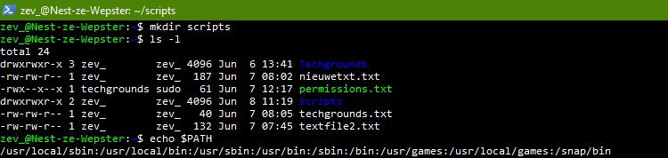
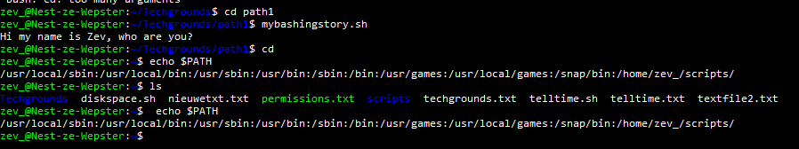
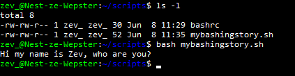
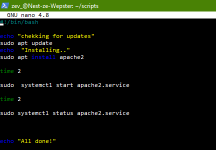
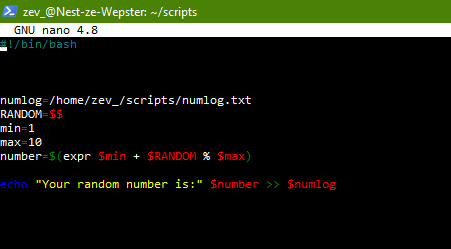
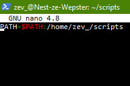

**Linux-07 Bash scripting**
===

**Key-terms**
---

*Bash:* Bourne Again SHell is een populaire Unix shell en command taal dat met een CLI komt om te kunnen communiceren met het OS.

*Command Line Interface (CLI):* CLI is een op tekst gebaseerde interface waarmee gebruikers kunnen communiceren met de computer door commando's in te typen. Bash biedt een krachtige CLI voor het uitvoeren van commando's en het beheren van het systeem.

*Shell-scripting:* Shell-scripting verwijst naar het proces van het schrijven van scripts of programma's met behulp van een shell, zoals Bash, om taken te automatiseren of een reeks commando's uit te voeren.

*Variabelen:* Variabelen in Bash worden gebruikt om gegevens op te slaan en te manipuleren. Ze kunnen tekst, getallen of andere soorten waarden bevatten. Variabelen worden doorgaans geschreven in hoofdletters volgens de conventie.

*Controlestructuren:* Bash biedt verschillende controlestructuren om de uitvoeringsvolgorde in een script te beheren. Dit omvat voorwaardelijke instructies zoals if-else en lussen zoals for en while, waarmee je beslissingen kunt nemen en acties kunt herhalen op basis van bepaalde voorwaarden.

**Opdracht**
---
*Exercise 1:*

- Create a directory called ‘scripts’. Place all the scripts you make in this directory.

   

- Add the scripts directory to the PATH variable.

    *Screenshot gemaakt na de reboot*

    

    

- Create a script that appends a line of text to a text file whenever it is executed.

    

- Create a script that installs the httpd package, activates httpd, and enables httpd. Finally, your script should print the status of httpd in the terminal.

    

    [Click here to see the script running](../00_includes/LNX-07/runscript.png)

*Exercise 2:* 

- Create a script that generates a random number between 1 and 10, stores it in a variable, and then appends the number to a text file.

*Exercise 3:*

Numbers get stored and tells you if the number was the same or lower than 5

*Gebruikte bronnen*

[Ask Ubuntu](https://ubuntu.com/tutorials/install-and-configure-apache#4-setting-up-the-virtualhost-configuration-file)

[Ubuntu](https://help.ubuntu.com/community/Beginners/BashScripting?_ga=2.266382478.1443873597.1686224927-618742906.1686224927#Scripting)

[cyberciti](https://www.cyberciti.biz/faq/star-stop-restart-apache2-webserver/)

*Ervaren problemen*

Ik zie nu in mijn [screenshot](C:\Users\Gebruiker\Git\TechgroundsGIT\techgrounds-ZevWepster\00_includes\LNX-07\BashScript.png) dat ik "time" heb gebruikt ipv "sleep" en die ook aangeeft dat de command niet word herkent, dit maakte echter niks uit voor het script.

Door een vraag van een van mijn peers kwam ik er achter dat ik de opdracht 1 verkeerd had begrepen. Voor leerdoeleinde plaats ik hieronder wat ik eerst had gedaan.

 

*Resultaat*

Gelukt! screenshots te vinden bij de opdrachten.

