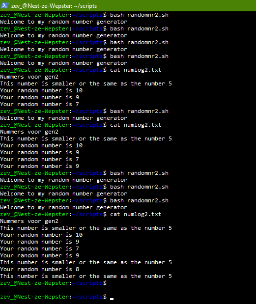

**Linux-07 Bash scripting**
===

**Key-terms**
---

**Opdracht**
---
*Exercise 1:*

- Create a directory called ‘scripts’. Place all the scripts you make in this directory.

   [mkdir](../00_includes/LNX-07/mkdir.png)

- Add the scripts directory to the PATH variable.

    [Adding PATH](../00_includes/LNX-07/addPATH.png)

- Create a script that appends a line of text to a text file whenever it is executed.

    [Oneliner](../00_includes/LNX-07/bashoneline.png)

- Create a script that installs the httpd package, activates httpd, and enables httpd. Finally, your script should print the status of httpd in the terminal.

    [The bash script](../00_includes/LNX-07/BashScript.png)

    [Script run](../00_includes/LNX-07/runscript.png)

*Exercise 2:* 

- Create a script that generates a random number between 1 and 10, stores it in a variable, and then appends the number to a text file.

[Random number gets stored](../00_includes/LNX-07/random%20nr%20script.png)

[Bashscript for the first number generator](../00_includes/LNX-07/Bashrandomgen1.png)

*Exercise 3:*

[Bashscript for second generator](../00_includes/LNX-07/nano%20randonr.png)

*Gebruikte bronnen*

[Ask Ubuntu](https://ubuntu.com/tutorials/install-and-configure-apache#4-setting-up-the-virtualhost-configuration-file)

[Ubuntu](https://help.ubuntu.com/community/Beginners/BashScripting?_ga=2.266382478.1443873597.1686224927-618742906.1686224927#Scripting)

[cyberciti](https://www.cyberciti.biz/faq/star-stop-restart-apache2-webserver/)

*Ervaren problemen*

*Resultaat*

Gelukt! screenshots te vinden bij de opdrachten.

