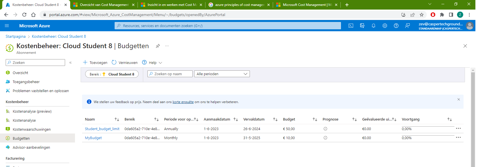

**AZ-02 - Cost Management + Billing **
===
**Key-terms**
---

**CAPEX:** 
Capital Expenditure. some key characteristics are:
- Own infrastructure
- Big Initial investment 
- Lots of maintanance
    - Support staff
    - Power & Networking
    - Hardware faillures
    - other

**OPEX:** Operational Expenditure. some key characteristics are:
- Rent infrastructure
- No initial investment
- Minimal maintanance
    - Operations team

**Opdracht**
---
- Maak een alert aan waarmee je eigen kosten kan monitoren.

Hierboven zie je een door mij aangemaakt alert genaamd MyBudget. Dit budget staat ingesteld op €10 en word elke maand opnieuw ingesteld. Ik krijg een waarschuwing als ik 80% van mijn budget heb gebruikt.

- Begrijp de opties die Azure aanbiedt om je uitgaven in te zien.

Azure bied verschillende opties om je uitgaven in te zien, hieronder enkele van de belangrijkste beschreven.
    
    - Azure Portal: De Azure portal is een Webbased Interface waarmee je toegang hebt tot alle Azure services, inclusief 'kostenbeheer en facturering'. Via de portal kun je facturen bekijken, kostenrapporten genereren, budgetten instellen en gebruik maken van andere tools voor kostenbeheer.

    - Azure Cost Manangement + Billing: Specifieke service voor kostenbeheer binne Azure.

    - Kostenrapporten: Azure bied uitgebreide kostenrapporten waarmee je je uitgaven kunt analyseren op verschillende dimensies. Je kunt aangepaste rapporten maken om specifieke kosteninformatie te bekijken en analyseren.

    - Budgetten: Je kan budgetten instellen om uitgave onder controle te houden. Je kunt waarschuwingen instellen om op de hoogte te worden gehouden wanneer er een gedefineerd limiet word overschreden.

    - Azure Advisor: Azure Advisor is een service die aanbevelingen biedt om de prestaties, beveiliging en kostenoptimalisatie van je resources te verbeteren. Het kan je helpen kostenbesparingsmogelijkheden te identificeren en je uitgaven efficiënter te beheren.

    - Azure Consumption API: Dit is een API waarmee je programmatisch toegang hebt tot je Azure-verbruiksgegevens. Hiermee kun je je eigen aangepaste oplossingen bouwen voor kostenbeheer en rapportage.

*Gebruikte bronnen*

[Microsoft](https://learn.microsoft.com/nl-nl/azure/cost-management-billing/costs/overview-cost-management)

*Ervaren problemen*
---

*Resultaat*
---

