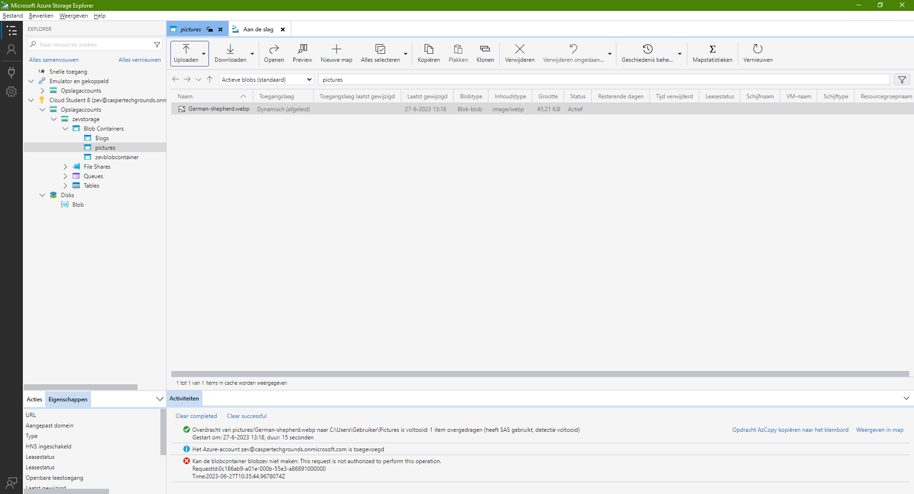
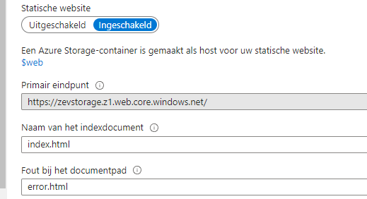

**AZ-05 - Azure Storage Account**
===
**Key-terms**
---

**Opdracht**
---

Opdracht 1:
- Maak een Azure Storage Account. Zorg dat alleen jij toegang hebt tot de data.

- Plaats data in een storage service naar keuze via de console (bijvoorbeeld een kattenfoto in Blob storage).

- Haal de data op naar je eigen computer door middel van de Azure Storage Explorer.

Ik ben vergeten tussentijds screenshots te maken maar in bovenstaande afbeelding is te zien dat ik in mijn Azure Storage Account een blobcontainer voor pics heb gemaakt, daar een foto heb geupload en die naar mijn pc gedownload via Azure Storage Explorer.

Opdracht 2:
- Maak een nieuwe container aan.

- Upload de 4 bestanden die samen de AWS Demo Website vormen.

- Zorg dat Static Website Hosting aan staat.

- Deel de URL met een teamgenoot. Zorg ervoor dat zij de website kunnen zien.

Hier boven zie je de 4 bestanden in een nieuwe container genaamd **$web**. Mijn peers konden de link openen.

*Gebruikte bronnen*

[learn.microsoft](https://learn.microsoft.com/en-us/azure/?product=storage)

*Ervaren problemen*
---
Als ik eerst een container aanmaakte dan had ik vervolgens geen rechten om iets toe te voegen terwijl ik wel bij het aanmaken een bestand direct kon uploaden en dan werkte het wel.

*Resultaat!*
---

