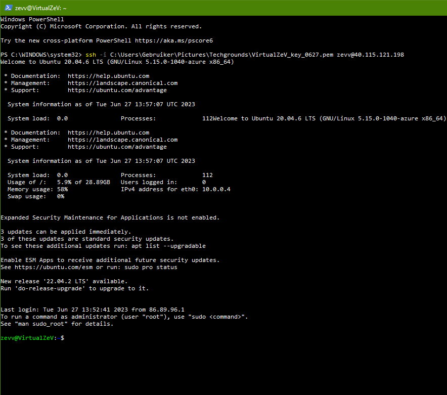
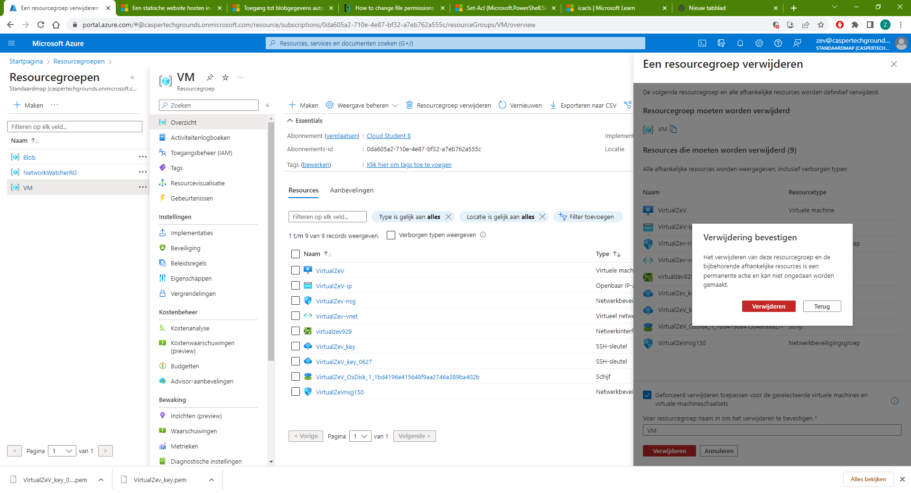

**AZ-06 - Azure Virtual Machines**
===
**Key-terms**
---
**VM:** Virtual Machine, de service die Azure gebruikt heet Azure Virtual Machines. VMs kan je gebruiken voor alles waar je een fysieke server zou gebruiken.

**RDP:** Remote Desktop Protocol, dit word gebruikt om verbinding te maken met Windows machines. Dit is het SSH protocol for Linux.

**vCPU:**

**RAM:**

**Data disks:**

**Max IOPS:**

**Temp Storage:**

**OS Disk:**

**NIC network security group:**

**Custom Data:**

**Cloud-Init script:**

**User data:**

**Opdracht**
---
- Log in bij je Azure Console.

- Maak een VM met de volgende vereisten:
    - Ubuntu Server 20.04 LTS - Gen1
    - Size: Standard_B1ls
    - Allowed inbound ports:
        - HTTP (80)
        - SSH (22)
    - OS Disk type: Standard SSD
    - Networking: defaults
    - Boot diagnostics zijn niet nodig
    - Custom data: 

            #!/bin/bash
            sudo su
            apt update
            apt install apache2 -y
            ufw allow 'Apache'
            systemctl enable apache2
            systemctl restart apache2

- Controleer of je server werkt.

Let op! Vergeet na de opdracht niet alles weer weg te gooien. Je kan elk onderdeel individueel verwijderen, of je kan in 1 keer de resource group verwijderen.

*Gebruikte bronnen*

Peers

*Ervaren problemen*
---
Ik was vergeten de filename in het ssh path te zetten, dit viel een van mijn peers op. Verder geen problemen.

*Resultaat!*
---

