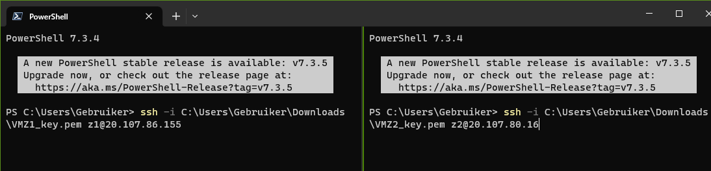
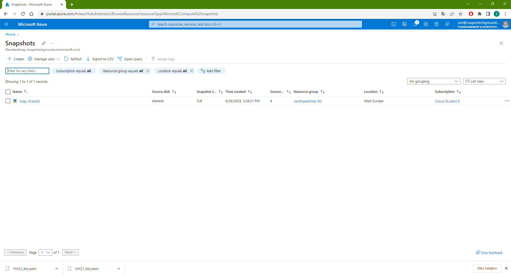

**AZ-07 - Azure Disk Storage**
===
**Key-terms**
---

**Unmanaged Disk:** In Unmanaged Disk storage, you must create a storage account in resources to hold the disks (VHD files) for your Virtual Machines.

**Managed Disk:** With Managed Disk Storage, you are no longer limited by the storage account limits. You can have one storage account per region.

**Incremental Snapshot:** Incremental snapshots are point-in-time backups for managed disks that, when taken, consist only of the changes since the last snapshot. The first incremental snapshot is a full copy of the disk. The subsequent incremental snapshots occupy only delta changes to disks since the last snapshot.

**Opdracht**
---

- Start 2 Linux VMs. Zorgt dat je voor beide toegang hebt via SSH.

- Maak een Azure Managed Disk aan en koppel deze aan beide VMs tegelijk.

- Creëer op je eerste machine een bestand en plaats deze op de Shared Disk.

- Kijk op de tweede machine of je het bestand kan lezen.

- Maak een snapshot van de schijf en probeer hier een nieuwe Disk mee te maken

- Mount deze nieuwe Disk en bekijk het bestand. 

*Gebruikte bronnen*

[Microsoft](https://learn.microsoft.com/en-us/azure/virtual-machines/linux/attach-disk-portal?tabs=ubuntu#connect-to-the-linux-vm-to-mount-the-new-disk)

[Microsoft](https://learn.microsoft.com/en-us/azure/virtual-machines/linux/add-disk?tabs=ubuntu)

[Communicationsquare](https://www.communicationsquare.com/news/azure-managed-disks-vs-unmanaged-disks/#:~:text=Difference%20Between%20Azure%20Managed%20Disks%20and%20Unmanaged%20Disks,-Microsoft%20has%20two&text=In%20Unmanaged%20Disk%20storage%2C%20you,one%20storage%20account%20per%20region.)

*Ervaren problemen*
---

Het hele process een aantal keer over gedaan om het beter te begrijpen en uit te vinden hoe het werkte. om er uiteindelijk achter te komen dat het eigenlijk niet kan. Ik had de vraag anders geinterpreteerd.

*Resultaat!*
---

