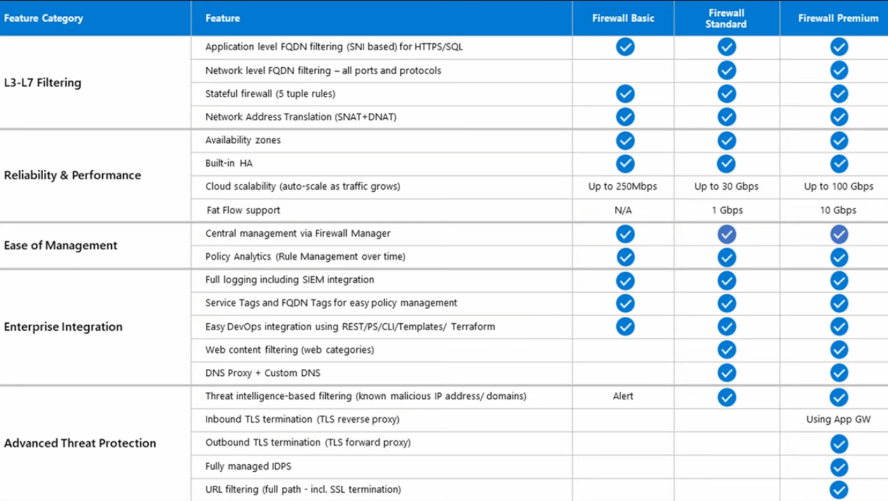
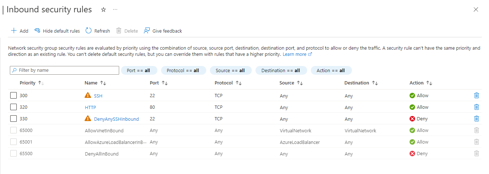

**AZ-08 - Firewalls**
===
**Key-terms**
---

**Firewall:** Is a network security service that monitors and controls incoming and outgoing traffic.

**Azure Firewall:** Is a managed cloud-based firewall service (PaaS, Firewall as a service). It has built-in high availability, its highly scalable, can control any incoming and outgoing traffic, supports FQDN and is fully intergrated with azure monitor for logging and analytics. You can choose between an Basic, Standard and Premium.

**Firewall policy:** Is also known as rules. It is a collection of rules and settings.

**Vnet:** A Virtual Network is provided by cloud serviceproviders such as Azure or AWS and offers the possibility to create isolated networkinfrastructures for hosting VMs services and other resources.

**Hub-and-spoke network:** Is a networkmodel for efficiently managing communication and security requirements. 

**NSG:** Network Security Group, is a cheaper option that a Firewall Service.

**Opdracht**
---

- Zet een webserver aan. Zorg dat de poorten voor zowel SSH als HTTP geopend zijn.

- Maak een NSG in je VNET. Zorg ervoor dat je webserver nog steeds bereikbaar is via HTTP, maar dat SSH geblokkeerd wordt.

Hierboven een webserver met als regel dat ssh geblokeerd word maar wel HTTP toe staat.

*Gebruikte bronnen*

[Microsoft](https://learn.microsoft.com/en-us/azure/virtual-network/manage-network-security-group?tabs=network-security-group-portal)

[Microsoft](https://learn.microsoft.com/nl-nl/azure/cloud-adoption-framework/ready/azure-best-practices/hub-spoke-network-topology)

*Ervaren problemen*
---
Geen ervaren problemen.

*Resultaat!*
---

