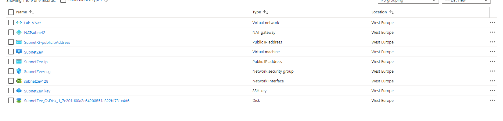
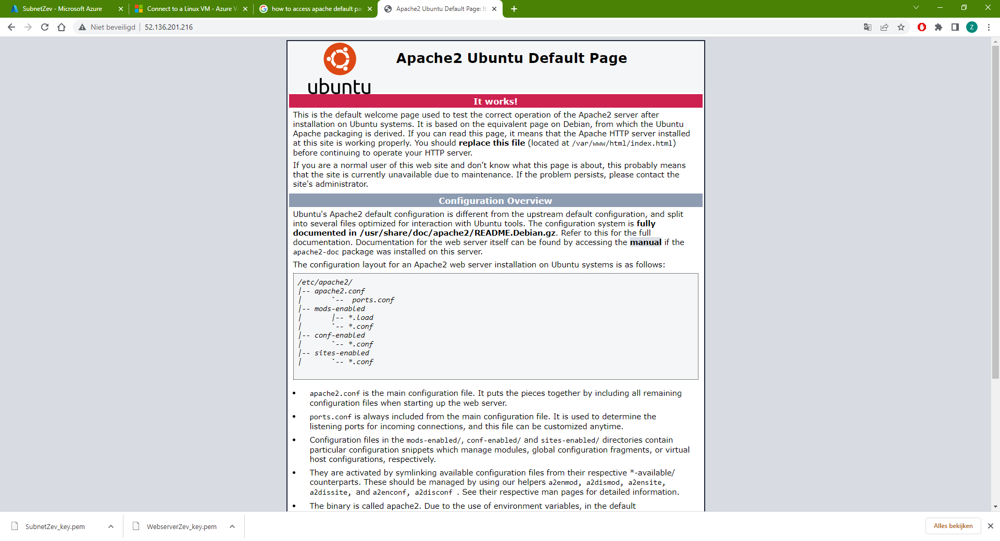

**AZ-10 - Azure Virtual Network (Vnet)**
===
**Key-terms**
---

**VNet:** VNets make sure resources like VMs, web apps and databases can communicate with each other, the users on the internet and the machines that are on-premise.

**VPN:** A Virtual Private Network is the easiest and most effective way for people to protect their internettraffic and keep their identities private online. 

There are 3 ways to connect to a on-premise network:

- Point-to-site VPNs:
    - The Azure VNet gets approached with a VPN coming from a on-premises computer.

- Site-to-Site VPN:
    - The on-prem VPN device of gateway gets connected with the Azure VPN Gateway. Wich creates one big local network.

- Azure Expressroute:
    - This is a phisical connection from your local envoirment to Azure.

    

**Opdracht**
---

Opdracht 1:
- Maak een Virtual Network met de volgende vereisten:

    - Region: West Europe
    - Name: Lab-VNet
    - IP range: 10.0.0.0/16
    - Vereisten voor subnet 1:
    - Name: Subnet-1
    - IP Range: 10.0.0.0/24

Dit subnet mag geen route naar het internet hebben

- Vereisten voor subnet 2:

    - Name: Subnet-2
    - IP Range: 10.0.1.0/24

Opdracht 2:
Maak een VM met de volgende vereisten:
Een apache server moet met de volgende custom data geïnstalleerd worden:

    #!/bin/bash
    sudo su
    apt update
    apt install apache2 -y
    ufw allow 'Apache'
    systemctl enable apache2
    systemctl restart apache2

Er is geen SSH access nodig, wel HTTP

Subnet: Subnet-2

Public IP: Enabled

Controleer of je website bereikbaar is

*Gebruikte bronnen*

Mijn eigen documentatie van de vorige opdrachten.

*Ervaren problemen*
---
Geen ervaren problemen.

*Resultaat!*
---

