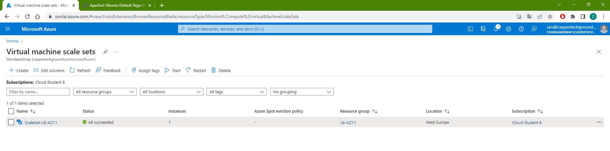
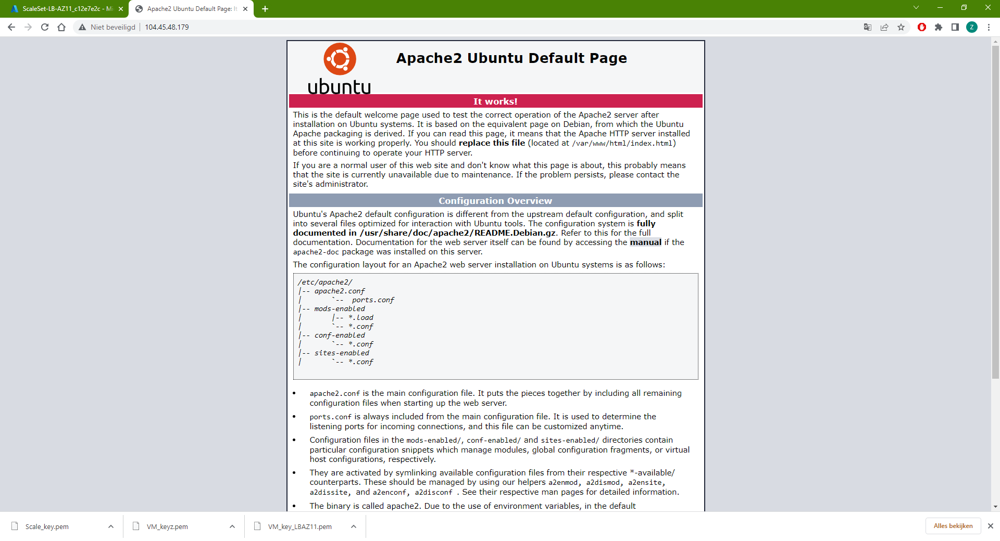
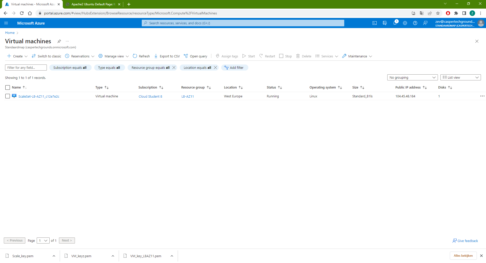
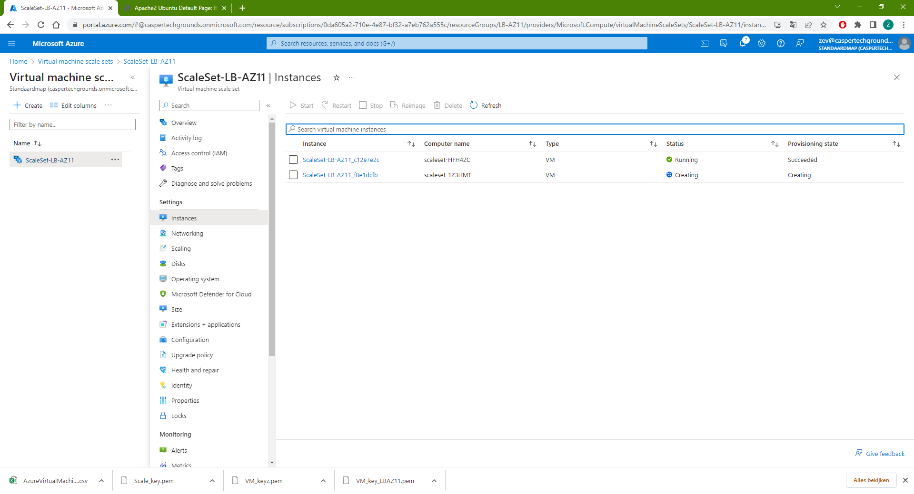

**AZ-11 Azure Load Balancer & Auto Scaling**
===
**Key-terms**
---

**Autoscaling:** settings to automatically scale (add or remove) a VM if needed.

**Scale Set:** is a set of identical VMs.

**Azure Monitor:** Azure Monitor is a comprehensive monitoring solution for collecting, analyzing, and responding to telemetry from your cloud and on-premises environments.

**Load Balancer:** Allows efficient distribution of load or incoming networktraffic across a group of backend resources or servers. Typical terms for Load Balancers are:

    - Frontend IP config: private or public IP
    - Backend pools: group of servers
    - Health probes: monitoring backend pool health
    - Load balancing rules: traffic ditribution to backend
    - Inbound NAT rules: binding of specific IP/port to specific instance in backend pool.

**Application Gateway:** Is a program that serves as a firewall proxy. It is responsible for filtering incoming traffic that contains network application data.

**SSL termination:** This refers to the process of decrypting encrypted traffic before passing it along to a web server.

**WAF:** Web Application Firewall

**Opdracht**
---
- Opdracht 1:

    - Maak een Virtual Machine Scale Set met de volgende vereisten:

            Ubuntu Server 20.04 LTS - Gen1
            Size: Standard_B1ls
            Allowed inbound ports:
            SSH (22)
            HTTP (80)
            OS Disk type: Standard SSD
            Networking: defaults
            Boot diagnostics zijn niet nodig
            Custom data:

                #!/bin/bash
                sudo su
                apt update
                apt install apache2 -y
                ufw allow 'Apache'
                systemctl enable apache2
                systemctl restart apache2

            Initial Instance Count: 2
            Scaling Policy: Custom
            Aantal VMs: minimaal 1 en maximaal 4
            Voeg een VM toe bij 75% CPU gebruik
            Verwijder een VM bij 30% CPU gebruik

Opdracht 2:
Controleer of je via het endpoint van je load balancer bij de webserver kan komen.
Voer een load test uit op je server(s) om auto scaling the activeren. Er kan een delay zitten in het creëren van nieuwe VMs, afhankelijk van de settings in je VM Scale Set.

In volgorde van wat er gevraagd word:

*Gebruikte bronnen*

[Microsoft](https://learn.microsoft.com/en-us/azure/virtual-machine-scale-sets/quick-create-portal)

[tecmint](https://www.tecmint.com/linux-cpu-load-stress-test-with-stress-ng-tool/)

*Ervaren problemen*
---
Ik heb zeker 6x opnieuw een scale set aangemaakt, bij de laatste keer werden ineens wel automatisch de VMs gecreerd, alle keren ervoor gebeurde dit niet, ik weet niet wat ik anders heb gedaan. Anders gezegd ik heb volgens mij niks anders gedaan.

*Resultaat!*
---

