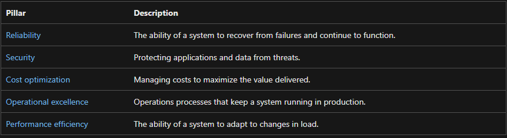

**AZ-12 - Well-Architected Framework**
===
**Key-terms**
---
**Azure Well-Architected Framework:** The Azure Well-Architected Framework is a set of guiding tenets that you can use to improve the quality of a workload. The framework consists of five pillars of architectural excellence:

The following diagram is a high-level overview of the Azure Well-Architected Framework:

In the center is the Well-Architected Framework, which includes the five pillars of architectural excellence. Surrounding the Well-Architected Framework are six supporting elements:

- Azure Well-Architected Review
- Azure Advisor
- Documentation
- Partners, Support, and Services Offers
- Reference architectures
- Design principles

**Opdracht**
---
Study

*Gebruikte bronnen*

[Microsoft](https://learn.microsoft.com/en-us/azure/well-architected/)

*Ervaren problemen*
---

Geen ervaren problemen

*Resultaat!*
---

