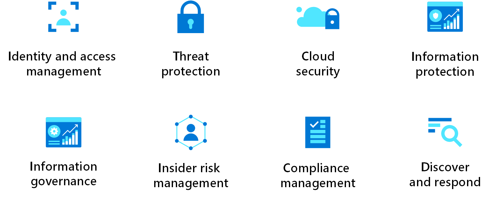

**AZ-12 - Well-Architected Framework**
===
**Key-terms**
---
**Azure Well-Architected Framework:** The Azure Well-Architected Framework is a set of guiding tenets that you can use to improve the quality of a workload. The framework consists of five pillars of architectural excellence:

**Reliability:** Reliability ensures that your application can meet the commitments you make to your customers. Architecting reliability into your application framework ensures that your workloads are available and can recover from failures at any scale.

Building for reliability includes:
- Ensuring a highly availible architecture
- Recovering from failures such as data loss, major downtime or ransomware incidents.

**Security:** Security is one of the most important aspects of any architecture. It provides the following assurances against deliberate attacks and abuse of your valuable data and systems:

- Confidentiality
- Integrity
- Availability

The security of complex systems depends on understanding the business context, social context, and technical context. As you design your system, cover these areas:

**Cost optimalization:** The cost optimization pillar provides principles for balancing business goals with budget justification. The principles help you create a cost-effective workload while avoiding capital-intensive solutions. Cost optimization is about looking at ways to reduce unnecessary expenses and improve operational efficiencies.

**Operational excellence:** The operational excellence pillar covers the processes that keep an application running in production. Deployments must be reliable and predictable. Automated deployments reduce the chance of human error. Fast and routine deployment processes don't slow down the release of new features or bug fixes. It's equally important to be able to quickly roll backward or forward if an update has problems.

**Performance Efficiency:** Performance efficiency is the ability of your workload to scale to meet the demands placed on it by users in an efficient manner. Before cloud computing became popular, when it came to planning how a system would handle increases in load, many organizations intentionally provisioned oversized workloads to meet business requirements.

To assess this all, you can make use of the **Microsoft Azure Well Architected Review**.

The following diagram is a high-level overview of the Azure Well-Architected Framework:

In the center is the Well-Architected Framework, which includes the five pillars of architectural excellence. Surrounding the Well-Architected Framework are six supporting elements:

- Azure Well-Architected Review
- Azure Advisor
- Documentation
- Partners, Support, and Services Offers
- Reference architectures
- Design principles

These supporting elements can help you achieve architectural excellence.

**Opdracht**
---
Study

*Gebruikte bronnen*

[Microsoft Learn](https://learn.microsoft.com/en-us/azure/well-architected/)

*Ervaren problemen*
---

Geen ervaren problemen

*Resultaat!*
---

