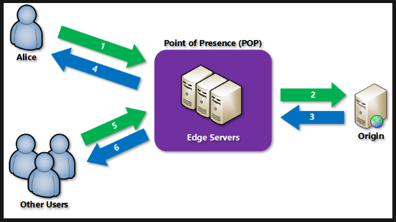

**AZ-13 - Files,AppServices,CDN,DNS,Database**
===
**Key-terms**
---
In this assingment we study the subject by the following questions:

- Waar is X voor?
- Hoe past X / vervangt X in een on-premises setting?
- Hoe kan ik X combineren met andere diensten?
- Wat is het verschil tussen X en andere gelijksoortige diensten?

Bestudeer:

**App Service**

Azure App Service is a HTTP based service (PaaS) for hosting web applications, REST API's and mobile back-ends. You can develop in any programming language. Applications can be easily executed and scaled in Windows and Linux-based environments.

App Service adds the power of Azure to your application, such as security, load balancing, automatic scaling and automated management. additionally you can benefit from DevOps capabilities such as contininuous deployment from Azure DevOps, GitHub, Docker hub, and other sources, package management, staging environments, custom domain, and TLS/SSL certificates.

You pay for the Azure compute resources you use. This will determined by the App Service Plan under wich you run your apps.

There are other services you can use to host websites and web applications. For most cases App service is the best choice though. For the microservice architecture you could use Azure Spring Apps or Service Fabric. If you want more control over the VMs your code is applied to you can use Azure Virtual Machine. 

**Content Delivery Network (CDN)**

A CDN is a distributed network of servers that can efficiently deliver web content to users. a CDN store cached content on edge servers in point-of-presence (POP) locations that are close to end users, to minimize latency.

Azure CDN offers developers a global solution for rapidly delivering high-bandwidth content to users by caching their content at strategically placed physical nodes across the world. Azure CDN can also accelerate dynamic content, which can't get cached, by using various network optimizations using CDN POPs. For example, route optimization to bypass Border Gateway Protocol (BGP).

It works as follows:

1. A user (Alice) requests a file (also called an asset) by using a URL with a special domain name, such as <endpoint name>.azureedge.net. This name can be an endpoint hostname or a custom domain. The DNS routes the request to the best performing POP location, which is usually the POP that is geographically closest to the user.

2. If no edge servers in the POP have the file in their cache, the POP requests the file from the origin server. The origin server can be an Azure Web App, Azure Cloud Service, Azure Storage account, or any publicly accessible web server.

3. The origin server returns the file to an edge server in the POP.

4. An edge server in the POP caches the file and returns the file to the original requestor (Alice). The file remains cached on the edge server in the POP until the time-to-live (TTL) specified by its HTTP headers expires. If the origin server didn't specify a TTL, the default TTL is seven days.

5. More users can then request the same file by using the same URL that Alice used, and gets directed to the same POP.

6. If the TTL for the file hasn't expired, the POP edge server returns the file directly from the cache. This process results in a faster, more responsive user experience.

A real world use-case example would be Netflix who has content stored closer to the user group for less latency.

**Azure DNS**

Azure DNS is a hosting service for DNS domains that provides name resolution by using Microsoft Azure infrastructure. By hosting your domains in Azure, you can manage your DNS records by using the same credentials, APIs, tools, and billing as your other Azure services.

You can't use Azure DNS to buy a domain name. For an annual fee, you can buy a domain name by using App Service domains or a third-party domain name registrar. Your domains then can be hosted in Azure DNS for record management.

The following features are included with Azure DNS:

- Security: Azure DNS is based on AzureResource Manager wich provides features such as:
    - Azure Role-Based Access Control (Azure RBAC)
    - Activity logs
    - Resource locking
- DNSSEC

Azure DNS does not currently support DNSSEC. In most cases, you can reduce the need for DNSSEC by consistently using HTTPS/TLS in your applications. If DNSSEC is a critical requirement for your DNS zones, you can host these zones with third-party DNS hosting providers.

- Ease of use
- Customizable virtual networks with private domains
- Alias records

**Opdracht**
---

In the assignments we will look at it in a more practical side with the following questions:

    - Waar kan ik deze dienst vinden in de console?
    - Hoe zet ik deze dienst aan?
    - Hoe kan ik deze dienst koppelen aan andere resources?

**- Azure Files**

- Waar kan ik deze dienst vinden in de console?

You can deploy Azure Files in two main ways: by directly mounting the serverless Azure file shares or by caching Azure file shares on-premises using Azure File Sync. Deployment considerations will differ based on which option you choose.

- Hoe zet ik deze dienst aan?

For Azure file share access you will need to make a storage account, where you then can make a file share. Both are needed if you want to set up a File Sync.

the prerequisites for deploying a file sync are:

1. An Azure file share in the same region you want to deploy Azure File Sync.
2. The following setting in your storage account must be enabled to allow File Sync access
    - SMB security settings must allow SMB 3.1.1 protocol version, NTLM v2 authentication and AES-128-GCM encryption.
    - Allow storage account key access must be Enabled.
3. At least one supported instance of Windows Server to sync with.
4. **Optional:** If you intend to use Azure File Sync with a Windows Server Failover Cluster, the File Server for general use role must be configured prior to installing the Azure File Sync agent on each node in the cluster. 
5. Although cloud management can be done with the Azure portal, advanced registered server functionality is provided through PowerShell cmdlets that are intended to be run locally in either PowerShell 5.1 or PowerShell 6+.

- Hoe kan ik deze dienst koppelen aan andere resources?

**- Azure Database**

- Waar kan ik deze dienst vinden in de console?
- Hoe zet ik deze dienst aan?
- Hoe kan ik deze dienst koppelen aan andere resources?

*Gebruikte bronnen*

*Ervaren problemen*
---

Geen ervaren problemen

*Resultaat!*
---

