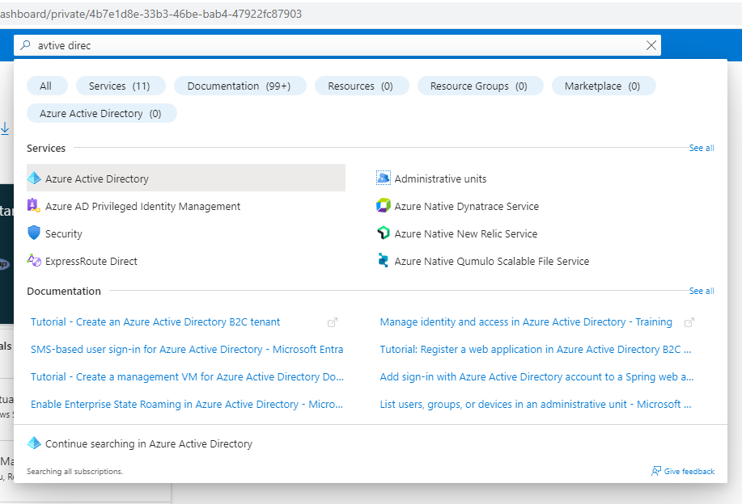
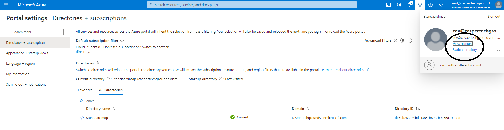
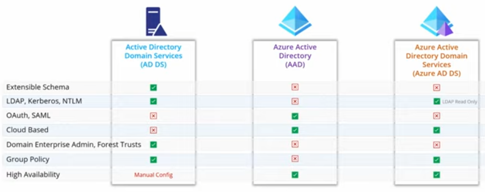
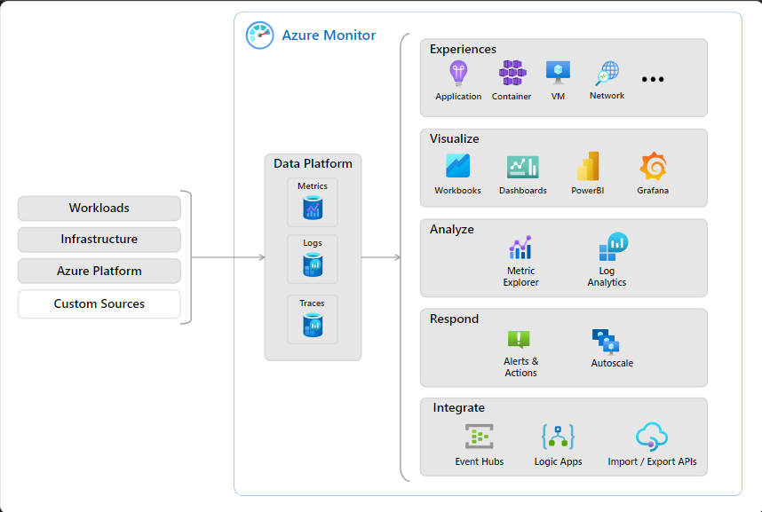
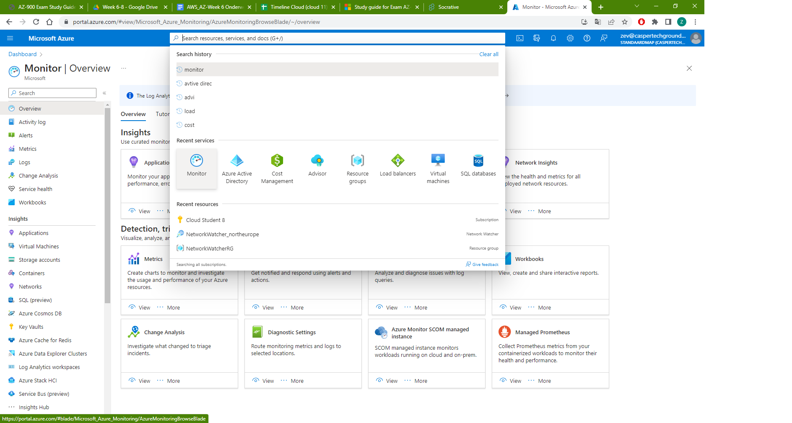
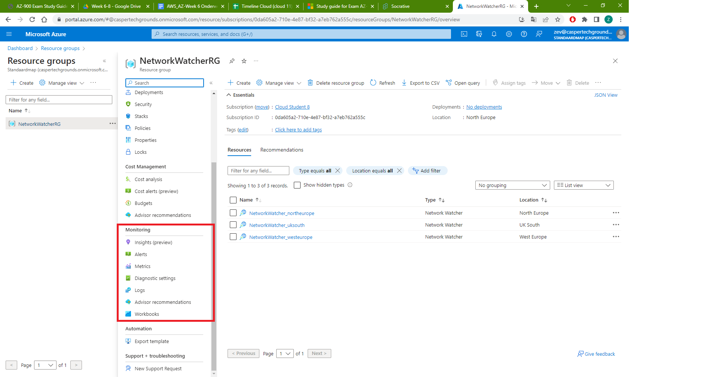
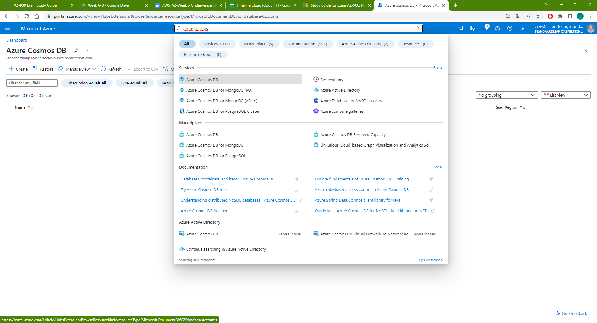
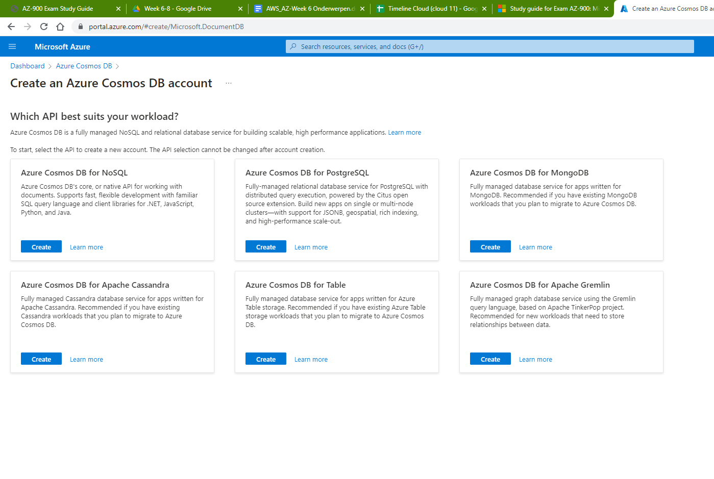
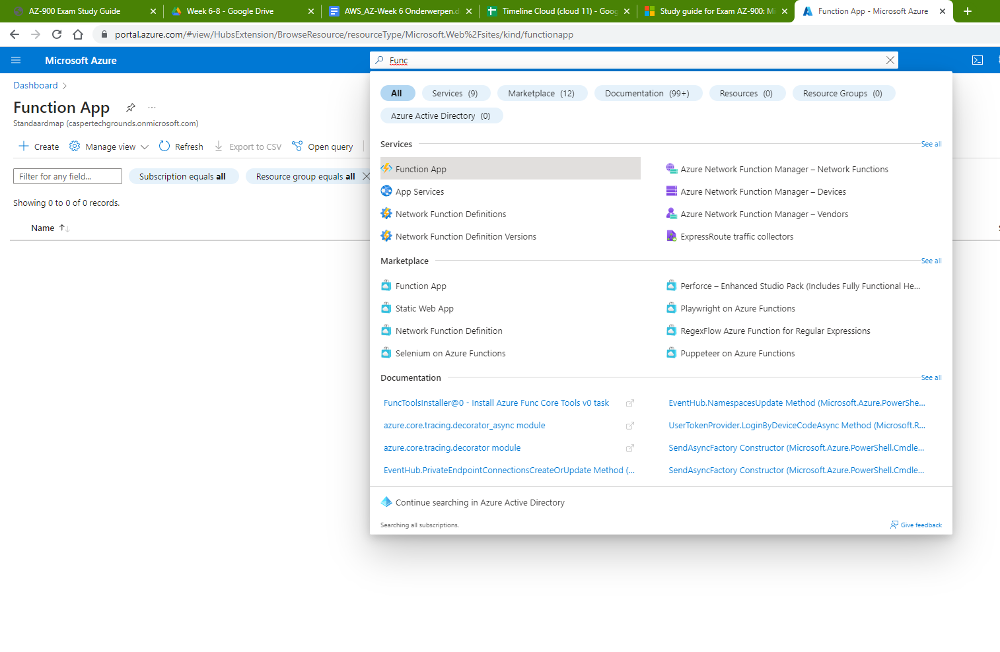

**AZ**
===

**Opdracht**
---
Bestudeer de onderwerpen en kijk ook naar de praktische kant van het onderwerp door de volgende vragen te beantwoorden:

- Waar kan ik deze dienst vinden in de console?
- Hoe zet ik deze dienst aan?
- Hoe kan ik deze dienst koppelen aan andere resources?

**Key-terms**
---
- **Azure Active Directory**: Azure Active Directory (Azure AD) is a cloud-based identity and access management service. Azure AD enables your employees access external resources, such as Microsoft 365, the Azure portal, and thousands of other SaaS applications. Azure Active Directory also helps them access internal resources like apps on your corporate intranet, and any cloud apps developed for your own organization.

Where to find it:
 The easiest way is trough the portal (even when you spell it wrong :P).  You can also switch Directories in your portal, if you have more, but in our overview we see there is only the one Casper made when making this account 

The image below shows 3 options for Active Directories. 

- **Azure Monitor**:Azure Monitor is a comprehensive monitoring solution for collecting, analyzing, and responding to telemetry from your cloud and on-premises environments. You can use Azure Monitor to maximize the availability and performance of your applications and services.

Use Azure Monitor to monitor these types of resources in Azure, other clouds, or on-premises:

        - Applications
        - Virtual machines
        - Guest operating systems
        - Containers including Prometheus metrics
        - Databases
        - Security events in combination with Azure Sentinel
        - Networking events and health in combination with Network Watcher
        - Custom sources that use the APIs to get data into Azure Monitor

Where to find it: The easiest way is to type it in the search bar wich gets you to a overview of all the things its able to monitor.

But you can also find it within your resources to monitor that specific resource.

- **CosmosDB**: Azure Cosmos DB is a fully managed NoSQL and relational database for modern app development. 

Azure Cosmos DB offers single-digit millisecond response times, automatic and instant scalability, along with guarantee speed at any scale. Business continuity is assured with SLA-backed availability and enterprise-grade security.

App development is faster and more productive thanks to:

- Turnkey multi region data distribution anywhere in the world
- Open source APIs
- SDKs for popular languages.

As a fully managed service, Azure Cosmos DB takes database administration off your hands with automatic management, updates and patching. It also handles capacity management with cost-effective serverless and automatic scaling options that respond to application needs to match capacity with demand. This is horizontal scaling.

CosmosDB can be found easiest in the portal by typing it in the search bar.

When you press create you get the option for several different type of databases:

Applies to:

- **Azure Functions** : Azure Functions is a serverless solution that allows you to write less code, maintain less infrastructure, and save on costs. Instead of worrying about deploying and maintaining servers, the cloud infrastructure provides all the up-to-date resources needed to keep your applications running.

This can easily be found in the Azure portal:

- **Event Grid, Queue Storage, Service Bus**: These are all services provided by Microsoft Azure that help with messaging and event-driven architectures.

**Event Grid** is a publish-subscribe messaging service for event-driven architectures

**Queue Storage** is a reliable message queuing service for asynchronous communication

**Service Bus** is a more advanced messaging service that supports various messaging patterns and scenarios. 

These services provide the foundation for building scalable, decoupled, and reactive applications in the Azure cloud environment.

Because i wanted a better understanding of how it works i asked ChatGPT to give me a real life example:

Certainly! Let's consider a real-life example of an e-commerce application that utilizes Event Grid, Queue Storage, and Service Bus.

**Event Grid:** Imagine you have an e-commerce website where customers can place orders. When a new order is placed, you want to notify various components of your application about this event. For example, you might want to update the inventory management system to reduce the stock of the ordered items, send a notification to the shipping service to prepare the order for shipment, and log the order details for analytics purposes. In this case, you can use Event Grid to publish an "OrderPlaced" event whenever a new order is received. The inventory management system, shipping service, and analytics component can subscribe to this event and react accordingly, ensuring that all necessary actions are taken in response to the new order.

**Queue Storage:** In our e-commerce example, after an order is placed, the application might need to perform some time-consuming tasks, such as generating invoices, processing payments, or sending confirmation emails. Instead of performing these tasks synchronously, which could slow down the customer experience, you can use Queue Storage to decouple these tasks from the order placement process. Whenever a new order is received, the application can enqueue messages in a queue, representing each task that needs to be performed. Background workers can then retrieve these messages from the queue and process them at their own pace. This allows the order placement process to be fast and responsive, while the time-consuming tasks are handled asynchronously in the background.

**Service Bus:** Continuing with our e-commerce example, let's say you want to implement a feature where customers can subscribe to notifications for specific product categories. Whenever a new product is added to the catalog, you want to notify all subscribed customers who are interested in that particular category. In this case, you can use Service Bus with topics and subscriptions. Each product category can be treated as a topic, and customers can subscribe to the topics they are interested in. When a new product is added to a category, the system can publish a message to the corresponding topic. Service Bus will then ensure that the message is delivered to all subscribed customers, allowing them to receive notifications about new products in their preferred categories.

In this example, Event Grid is used to notify different components about an order placement event, Queue Storage is used to offload time-consuming tasks from the order placement process, and Service Bus is used for category-based notifications to subscribed customers. These services help in building a scalable and responsive e-commerce application by enabling event-driven communication, asynchronous processing, and advanced messaging patterns.

*Gebruikte bronnen*

[Youtube - Adam Marczak Azure for Everyone](https://www.youtube.com/watch?v=Ma7VAQE7ga4)

[Youtube - John Savill](https://www.youtube.com/watch?v=v68jL-l9Fww)

[Learn Microsoft - CosmosDB](https://learn.microsoft.com/en-us/azure/cosmos-db/introduction)

[Youtube - ExamPro](https://www.youtube.com/watch?v=CXfeF46sIbM)

[Youtube - ExamPro](https://www.youtube.com/watch?v=NCYaUcoaAqo)

[ChatGPT](https://openai.com)

*Ervaren problemen*
---

Geen ervaren problemen

*Resultaat!*
---

