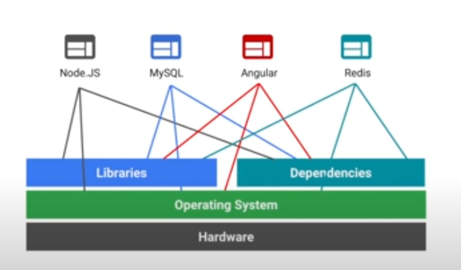
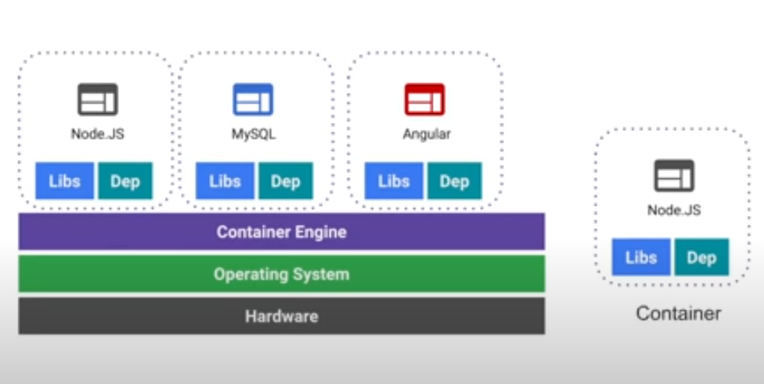
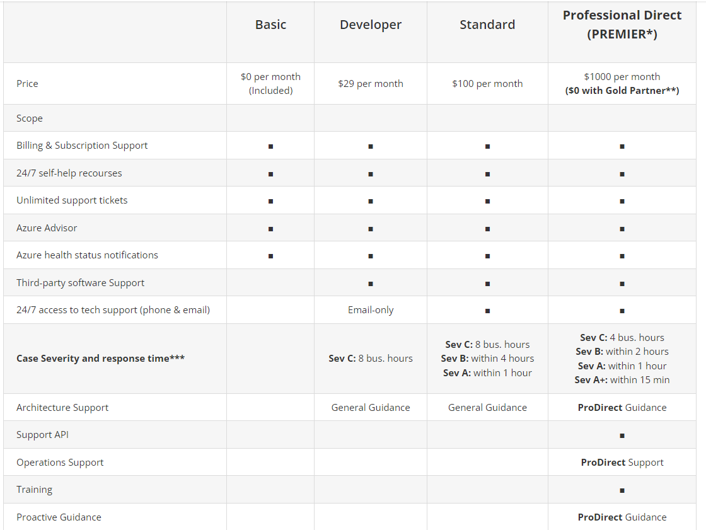

**AZ week 6**
===

**Opdracht**
---
Bestudeer de volgende onderwerpen aan de hand van deze vragen :

- Waar is X voor?
- Hoe past X / vervangt X in een on-premises setting?
- Hoe kan ik X combineren met andere diensten?
- Wat is het verschil tussen X en andere gelijksoortige diensten?

**Key-terms**
---

- **Containers:** A container is an application thats been packaged with all the Files, Configurations and dependencies necessary for it to run. Containers are used to help with Building, Shipping, Deploying and Scale with ease by providing isolated containers.

If we take a look at the traditional way of implementing this, we will see that every app or piece of code has its own connection with the OS and their libraries.

If we then look at this picture of how the containers are used to implement we wil see that a Container Engine (like Docker) was added. This will help "contain" the applications with their respective libraries and dependencies as a package which can be used at other machines as well.

on premisses it replaces servers, in the cloud it can replace VMs. VMs work at hardware level of virtualization while containers run on Operating System level.

- **Azure Support Plans:** Microsoft Azure offers multiple support plan options, from Basic support if you are just starting with your digital transformation strategy, to Professional level support to fit larger companies who are relying on the cloud to operate critical business applications and solutions.

- **Azure Advisor:** Advisor is a personalized cloud consultant that helps you follow best practices to optimize your Azure deployments. It analyzes your resource configuration and usage telemetry and then recommends solutions that can help you improve the cost effectiveness, performance, Reliability (formerly called High availability), and security of your Azure resources.

With Advisor, you can:

- Get proactive, actionable, and personalized best practices recommendations.
- Improve the performance, security, and reliability of your resources, as you identify opportunities to reduce your overall Azure spend.
- Get recommendations with proposed actions inline, divided in 5 categories:

    - **Reliability:** Get's used to ensure the continuity and improvement of your app.
    - **Security:** Get's used to detect treats and weak spots.
    - **Performance:** Used to improve the speed of your apps.
    - **Cost:** Used to optimize and reduce your total Azure spending's.
    - **Optimization of operational activities:** Used to realize the efficiency of processes and workflows, manage resources and implement recommended procedures.

To get a nice overview you can use the Azure portal to get to the Azure Advisor Dashboard.

- **Azure App Configuration:** Azure App Configuration provides a service to centrally manage application settings and feature flags. Modern programs, especially programs running in a cloud, generally have many components that are distributed in nature. Spreading configuration settings across these components can lead to hard-to-troubleshoot errors during an application deployment. Use App Configuration to store all the settings for your application and secure their accesses in one place.

- **Azure Activity Log:** The Azure activity log is a platform log in Azure that provides insight into subscription-level events. The activity log includes information like when a resource is modified or a virtual machine is started. You can view the activity log in the Azure portal or retrieve entries with PowerShell and the Azure CLI. 

**All the terms above was asked in the assignment, the terms covered below I came across while researching and will lighty touch the subject with the following questions:**

- Waar is X voor?

- Waar wordt X voor gebruikt?

**Docker**: Docker is the leading software that is used to create, manage and run containers. On both Linux and Windows, Containers must be packaged with the same OS to work on that same OS.

**Kubernetes**: Kubernetes is a container orchestrator. Its used to easy upscale (e.g.) Docker containers

*Gebruikte bronnen*

[Youtube - IBM Technology](https://www.youtube.com/watch?v=cjXI-yxqGTI)

[TMC](https://abouttmc.com/microsoft-azure-cloud/microsoft-azure-support-plans/)

[Youtube - Cloud Academy](https://www.youtube.com/watch?v=9RiiNW1zqJM)

[Learn Microsoft - Azure Advisor](https://learn.microsoft.com/en-us/azure/advisor/advisor-overview)

[Learn Microsoft - App Config](https://learn.microsoft.com/en-us/azure/azure-app-configuration/overview)

[Learn Microsoft - Activity Logs](https://learn.microsoft.com/en-us/azure/azure-monitor/essentials/activity-log?tabs=powershell)

*Ervaren problemen*
---

Geen ervaren problemen

*Resultaat!*
---

