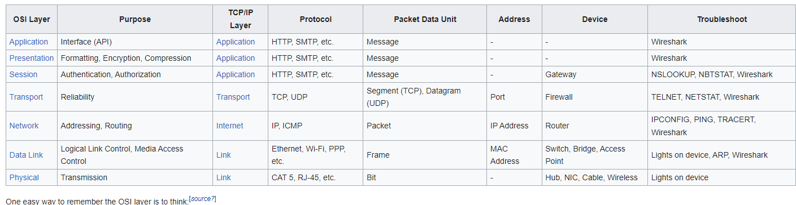
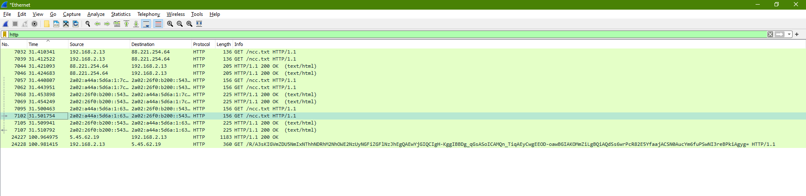
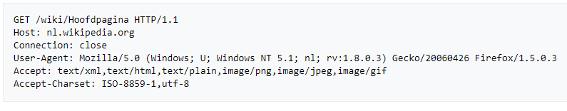

**NTW-03 - Protocols**
===

**Key-terms**
---

- **HTTP:** Hypertext Transfer Protocol is a protocol used for transmitting and recieving web pages and other resources over the internet. It defines the the format and rules for communicating between webbrowsers and webservers.

- **SMTP:** Simple Mail Transfer Protocol is a protocol used for sending email messages between servers on the internet

- **TCP:** Transmission Control Protocol is a connection-oriented protocol that provides reliable, ordered and errorchecked delivery of data packets over networks. It ensures that data sent from one device reaches the destination device accurately and in the correct order.

- **UDP:** User Datagram Protocol is a connectionless protocol that allows the exchange of datagrams (packets) between devices on a network. it is a lghtweight protocol that does not provide error-checking or reliable delivery, making it suitable for real-time applications like streaming media or online gaming.

- **IP:** Internet Protocol is a network protocol responsible for addressing and routing data packets across networks. It provides a unique IP address to each device connected to a network, allowing them to communicate with each other over the internet.

- **ICMP:** Internet Control Message Protocol is a protocol used for sending error messages and operational information between network devices. it is commonly used for diagnostic and troubleshooting purposes, such as spending ping requests to test network connectivity.

- **Ethernet:** Ethernet is a widely used wired networking technology that defines the standards for how devices communicate over local area networks (LANs). It specifies the physical and data link layers of the network protocol stack and enables devices to send and receive data packets.

- **Wi-Fi:** Wi-Fi is a wireless networking technology that allows devices to connect and communicate over a local area network (LAN) without the need for wired connections. It uses radio waves to transmit data between devices and typically provides internet access within a specific range.

- **PPP:** Point-to-Point Protocol is a data link layer protocol used for establishing a direct connection between two network nodes. it is commonly used for dial-up internet connections and allows devices to establlish and maintain  a secure point-to-point connection  over various physical mediums.

- **CAT 5:** Category 5 is a type of Ethernet cable commonly used for wired networks. It supports data transmission speeds up to 1000 Mbps (1 Gbps) and is used for connecting devices such as computers, routers, and switches within a local area network.

**Opdracht**
---
- Identify several other protocols and their associated OSI layer. Name at least one for each layer.

Ik vond deze handige tabel.

- Figure out who determines what protocols we use and what is needed to introduce your own protocol.

        	 The determination of protocols and their adaptation is a complex process involving various entities and factors. generally, protocols are developed, standarized, and adopted trough the collaboration of industry organizations, standard bodies and technology communities.
             The ARPA (Advanced Research Project Agency) part of the US Defense program was the first organization to introduce the concept of a standardized protocol. Support for network protocols can be built into the software, hardware or both. All network end-users rely on network protocols for connectivity.

- Look into wireshark and install this program. Try and capture a bit of your own network data. Search for a protocol you know and try to understand how it functions.

[Klik hier](../00_includes/NTW-03/wireshark.png) voor een screenshots van mijn packages in Wireshark.

Ik heb gekozen om HTTP te filteren

HTTP is het protocol voor de communicatie tussen en webclient (meestal een webbrowsrer of een app) en een webserver. Dit protocol word niet alleen veel op het wereldwijde web gebruikt maar ook op lokale netwerken (intranet).

In HTTP is vastgelegd welke vragen (requests) een client aan een server kan stellen en welke antwoorden (responses) een webserver daarop kan teruggeven. elke vraag beav een URL die naar een webcomponent of een statisch object zoals een webpagina of een plaatje verwijst.

Een HTTP-request bestaat uit de requestsoort, de URL, de headervelden (koptitelvelden) en eventueel een inhoud. 

een overzicht van de HTTP-requestmethoden 

    - GET: Ontvang het document gespecificeerd door de URL.
    - HEAD: Ontvang alleen de headers van het op te vragen document.
    - POST: Zend gegevens naar de server.
    - PUT: Vervang het document op de server door de verzonden data.
    - DELETE: Verwijder het document.
    - TRACE: Retourneert de aanvraag zodat een client kan zien welke wijzigingen of aanvullingen zijn gemaakt door tussenstations.
    - OPTIONS: Vraag de mogelijkheden op dit niveau aan van de server.
    - CONNECT: Vervangt de verbinding door een transparante TCP-/IP-tunnel, om bijvoorbeeld SSL-versleutelde communicatie (HTTPS) via een onversleutelde HTTP proxy te ondersteunen.
    - PATCH: Gedeeltelijke modificatie van het document (vervang een deel door de verzonden data).    

De belangrijkste headervelden zijn:

    - Content-Length: Geeft de lengte van de inhoud aan.

    - Location: Indien de server de webbrowser naar een andere pagina doorverwijst wordt hierbij het benodigde pad gevoegd.

    - Server: Omvat een beknopte beschrijving van de serversoftware (bijvoorbeeld "Apache/2.2.9 (Win32) PHP/5.2.6").

    - User-Agent: Geeft informatie over de aanvrager. Dit is meestal een webbrowser.
    
    - Date: De datum en het tijdstip waarop het document verzonden is.

    - Host*: Omdat het pakket naar een IP-adres wordt gestuurd weet de server niet op welk domein men aan het surfen is. In HTTP 1.1 is het verplicht om met deze header het domein mee te delen

Een complete aanvraag inclusied de headervelden kan er zo uitzien:

*Gebruikte bronnen*

[After Academy](https://afteracademy.com/blog/what-are-protocols-and-what-are-the-key-elements-of-protocols/)

[Wikipedia](https://nl.wikipedia.org/wiki/Hypertext_Transfer_Protocol)

*Ervaren problemen*

Geen ervaren problemen.

*Resultaat*
zie opdrachten.

