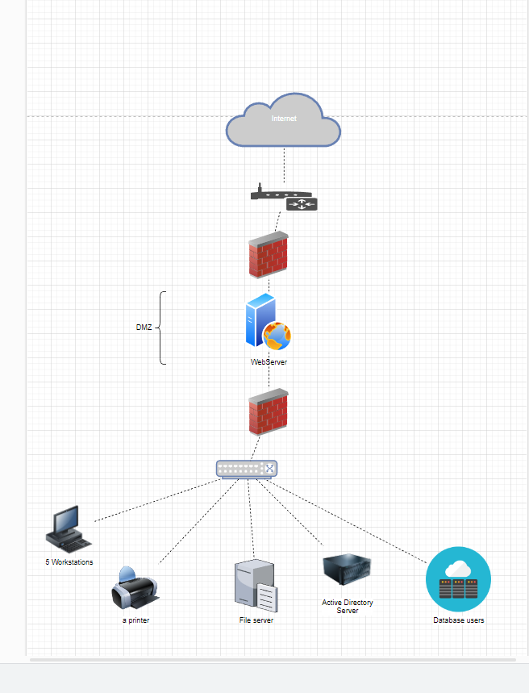

**NTW-07 - Networking Case Study**
===
**Key-terms**
---

**DMZ:** DeMilitarized Zone is just like the military term a bufferzone between borders. The borders in this case being The internet and a (private) network. This is used to give people access to certain things without giving access to the whole network. A home example would be a Playstation which is used for online gaming.

**AD server:** Active Directory server is a server that stores information about object on the network and makes this information easy to find and use for both admins and users. 

**Opdracht**
---

*Gebruikte bronnen*

[learn.microsoft](https://learn.microsoft.com/en-us/windows-server/identity/ad-ds/get-started/virtual-dc/active-directory-domain-services-overview)

[youtube](https://www.youtube.com/watch?v=dqlzQXo1wqo&ab_channel=PowerCertAnimatedVideos)

*Ervaren problemen*
---
Als ik de opdracht goed heb gedaan, geen ervaren problemen. 

*Resultaat*
---

Voor de extra veiligheid heb ik een DMZ gecreeerd met daarin alleen het hoognodige waar de 'buiten wereld' echt toegang tot nodig heeft zodat de rest van alle gegevens met een extra firewall beschermd is.

