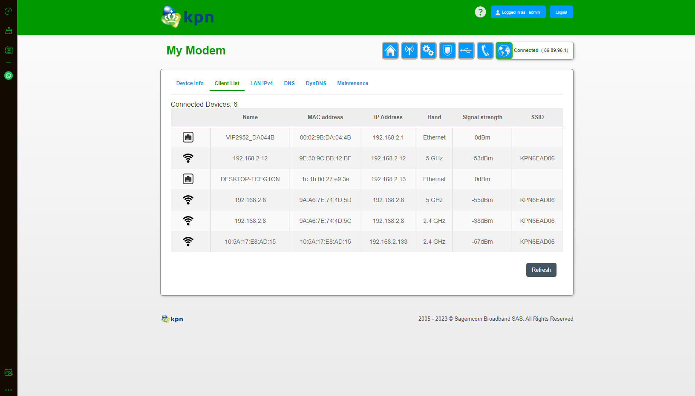
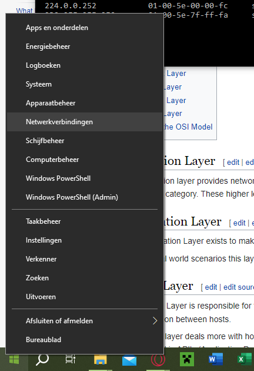
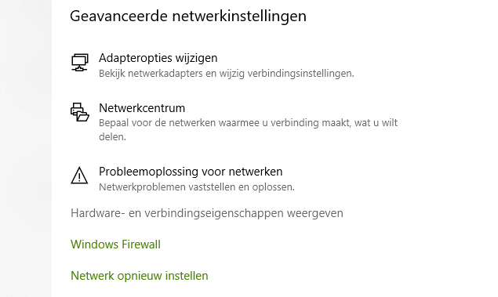
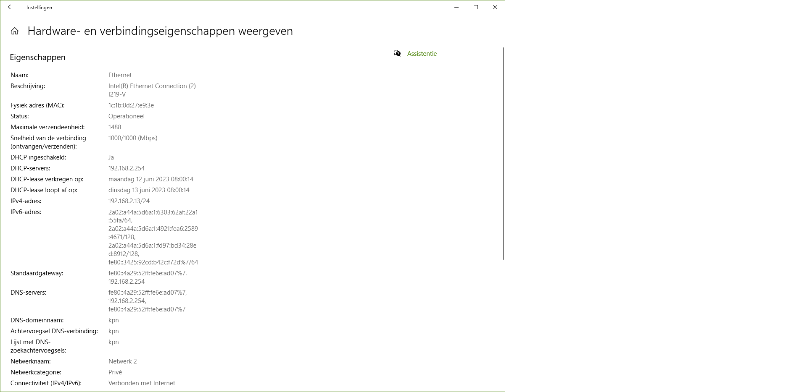
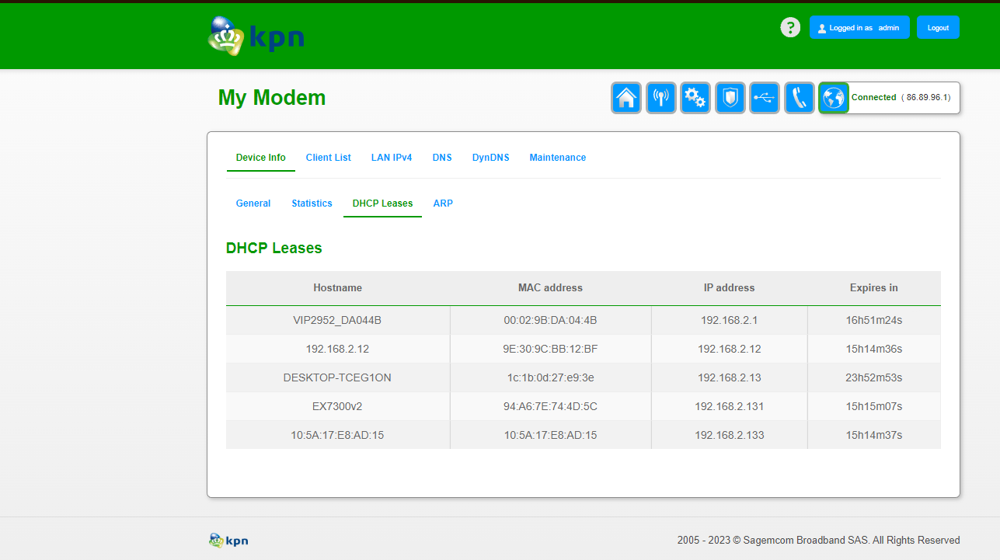

**NTW-02 Network Devices**
===

**Key-terms**
---

**Router:** A router is a network device used to send and receive data packets between computer networks. It acts as a connection point between multiple networks, such as a home network and the internet. Routers use IP addresses and routing tables to determine the optimal path for forwarding data packets between different networks. Routers are more intelligent than hubs or switches as they store information about the other network devices they are connected to.

**Switch:** A switch is a network device used to connect computers, printers, servers, and other network devices together within a local area network (LAN). It serves as a central connection point where devices are connected via Ethernet cables. A switch selectively forwards data packets only to the specific destinations based on the devices' MAC addresses, thereby efficiently distributing network traffic.

**Repeaters:** A repeater, also known as a signal booster, is a network device used to extend the range of a network signal. It receives the weak signal from a network and amplifies it, allowing the signal to be transmitted over a greater distance without degradation. Repeaters are commonly used in wireless networks or in wired networks where long distances need to be covered.

**Access Point:** An access point is a device used to enable wireless communication within a network. It acts as a wireless access point to a wired network, allowing wireless devices such as laptops, smartphones, and tablets to connect to the network. The access point receives and transmits data between the wireless devices and the wired network, providing wireless connectivity and access to network resources.

**Hubs:** Hubs are used to connect multiple network devices together. They can be used to transmit both digital and analog information. Digital information is transmitted as packets, whereas analog information is transmitted as a signal. Hubs also act as a repeater, which amplifies signals to have weakend after being transmitted across a long distance. Hubsa operate at the physical layer of the OSI model.

**Modem:** A modem, which is short for "modulators-demodulators", is a piece of networkhardware that is used to convert digital signal into analog signals back to a digital format.

**Opdracht**
---
- Benoem en beschrijf de functies van veel voorkomend netwerkapparatuur.

        Zie key terms.

- De meeste routers hebben een overzicht van alle verbonden apparaten, vind deze lijst. Welke andere informatie heeft de router over aangesloten apparatuur?

Hier onder vind je alle apparaten die verbonden zijn aan mijn router en verdere info.

- Waar staat je DHCP server op jouw netwerk? Wat zijn de configuraties hiervan?

Deze heb ik gevonden door met de rechtermuisknop op netwerkverbindingen te klikken

Vervolgens klik je op "Hardware- en verbindingseigenschappen weergeven"

En dan vind je hier je DHCP gegevens.

Ook kan ik in mijn router de leases bekijken

*Gebruikte bronnen*

[lepide.com](https://www.lepide.com/blog/the-most-common-types-of-network-devices/)

[TechTarget](https://www.techtarget.com/searchnetworking/definition/OSI)

[Infoblox](https://www.infoblox.com/glossary/dhcp-server/#:~:text=A%20DHCP%20Server%20is%20a,to%20broadcast%20queries%20by%20clients.)

*Ervaren problemen*

Ik kwam niet in mijn router settings via mijn webbrowser. Na mijn wachtwoord te hebben gereset werkte dit nog steeds niet. Toen heb ik mijn router en computer op nieuw opgestart en hierna werkte dit wel en kon ik verder met de opdracht.

*Resultaat*

