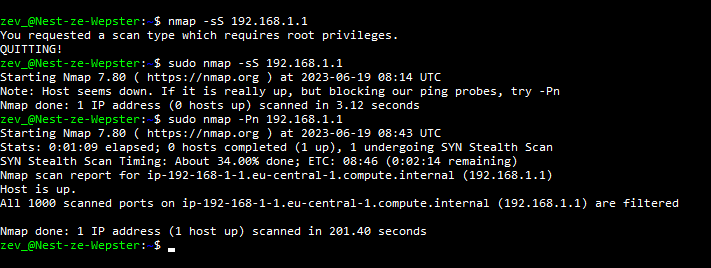

**SEC-01 Network detection**
===
**Key-terms**
---

**Nmap:** Network mapper is a tool that scans a network to find information about it. for example what ports are open in your network.

**Nmap scan types:** A variety of scans can be performed using Nmap.

**TCP scan:** A TCP scan is generally used to check and complete a tree-way handshake between you and a chosen target system. A TCP scan is in general very noisy.

**UDP scan:** UDP scans are used ti check wheter there is any UDP port up and listening for incoming requests on the target machine. Unlike TCP, UDP has no mechanism to respond with a positive acknowledgement, so there is always a chance for a false positive in the scan results. However, UDP scans are used to reveal Trojan horses that might be running on UDP ports or even reveal hidden RPC services.

**SYN scan:** This is another form of TCP scan. The difference is unlike a normal TCP scan, nmap itself crafts a syn packet, which is the first packet that is sent to establish a TCP connection. What is important to note here is that the connection is never formed, rather the responses to these specially crafted packets are analyzed by Nmap to produce scan results.

**ACK scan:** ACK scans are used to determine whether a particular port is filtered or not. This proves to be extremely helpful when trying to probe for firewalls and their existing set of rules. Simple packet filtering will allow established connections (packets with the ACK bit set), whereas a more sophisticated stateful firewall might not.

**FIN scan:** Also a stealthy scan, like the SYN scan, but sends a TCP FIN packet instead. Most but not all computers will send an RST packet (reset packet) back if they get this input, so the FIN scan can show false positives and negatives, but it may get under the radar of some IDS programs and other countermeasures.

**NULL scan:** Null scans are extremely stealthy scan and what they do is as the name suggests — they set all the header fields to null. Generally, this is not a valid packet and a few targets will not know how to deal with such a packet. Such targets are generally some version of windows and scanning them with NULL packets may end up producing unreliable results. On the other hand, when a system is not running windows this can be used as an effective way to get through.

**Opdracht**
---

- Scan the network of your Linux machine using nmap. What do you find?

First i needed to install, when its installed and i put in the Nmap command i get a small manual which shows me how to use the command. after picking a command to scan ports this was the result:

- Open Wireshark in Windows/MacOS Machine. Analyse what happens when you open an internet browser. (Tip: you will find that Zoom is constantly sending packets over the network. You can either turn off Zoom for a minute, or look for the packets sent by the browser between the packets sent by Zoom.)

*Gebruikte bronnen*
---

[Edureka](https://www.edureka.co/blog/nmap-tutorial/#:~:text=What%20is%20Nmap%3F,-Nmap%2C%20short%20for&text=Nmap%20is%20a%20free%20and,monitoring%20host%20or%20service%20uptime.)

*Ervaren problemen*
---

Wat trial & error met de commands voor Nmap, verder geen problemen ervaren.

*Resultaat*
---

