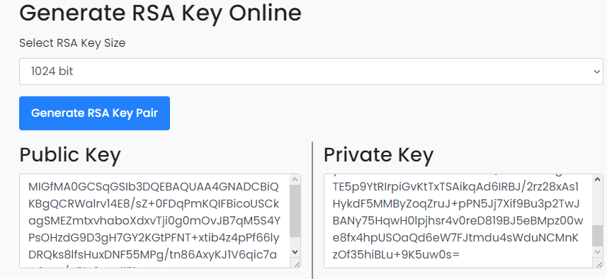
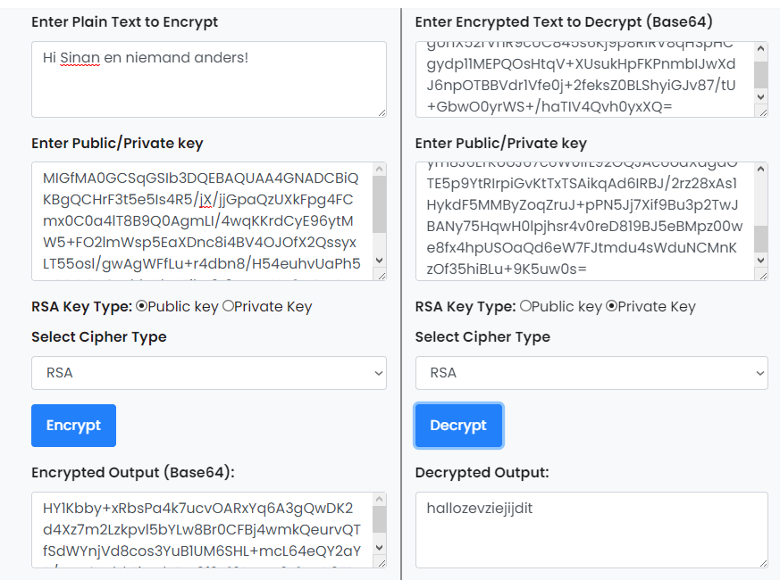

**SEC-05 - Asymmetric encryption**
===
**Key-terms**
---

**Asymetric ecryption:** In this way of encrypting you make use of a public and private key. This way, messages that are encrypted with your public key, can only be opened with your private key. 

**Public key:** Public keys are encrypted keys that can only be opened with the assigned private key. This key is visible for everyone and is used to send messages only you can open, if you kept your private key private. 

**Private key:** Private keys are created with public keys and are the actual key to open the messages encrypted by someone else with your public key. If I were to send a message back, I would encrypt my message with the recievers public key. 

**Opdracht**
---

- Generate a key pair.

- Send an asymmetrically encrypted message to one of your peers via the public Slack channel. They should be able to decrypt the message using a key. The recipient should be able to read the message, but it should remain a secret to everyone else. You are not allowed to use any private messages or other communication channels besides the public Slack channel. Analyse the difference between this method and symmetric encryption.

*Gebruikte bronnen*
---

[Key gen tool](https://www.devglan.com/online-tools/rsa-encryption-decryption)

[Baeldung](https://www.baeldung.com/cs/symmetric-cryptography)

*Ervaren problemen*
---

De site die in de opdracht als voorbeeld gegeven werd voldeed niet, andere site werkte beter en snapte daardoor de opdracht beter.

*Resultaat!*
---

