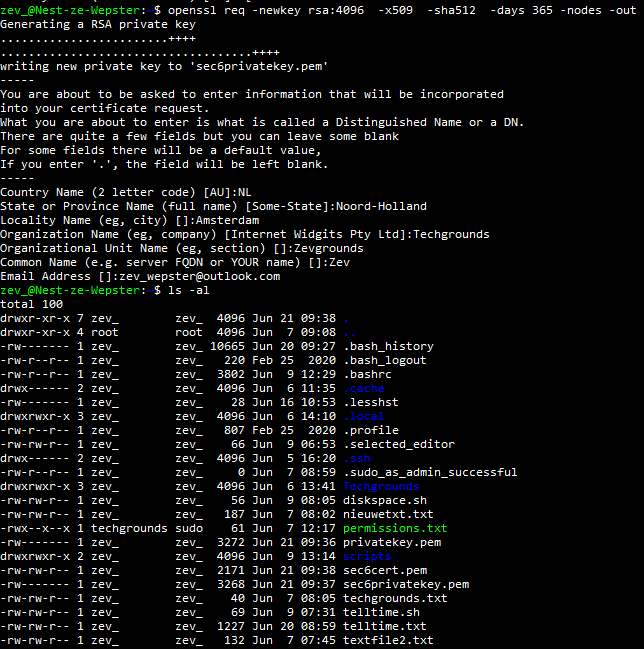
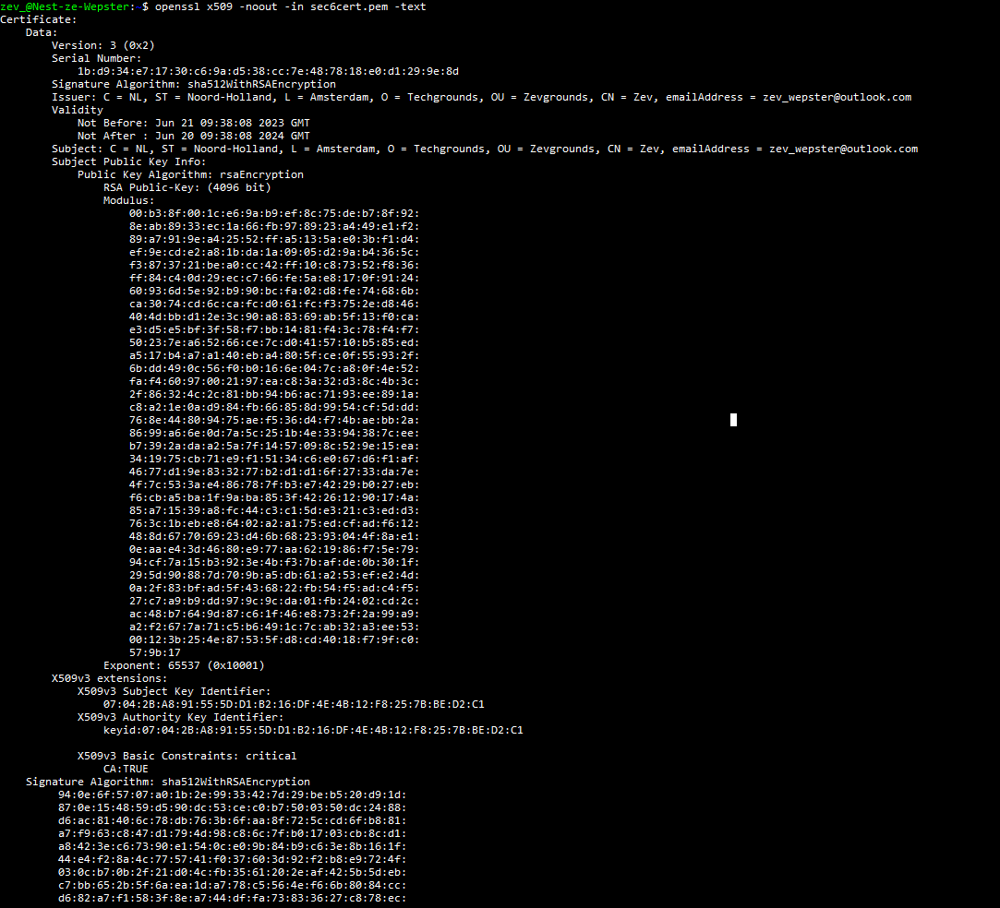
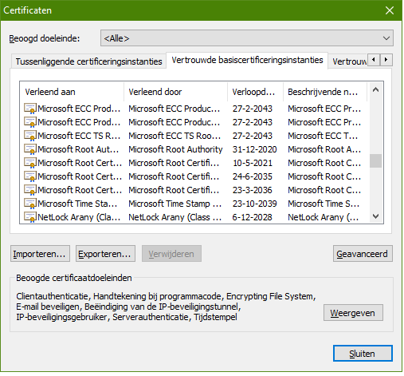
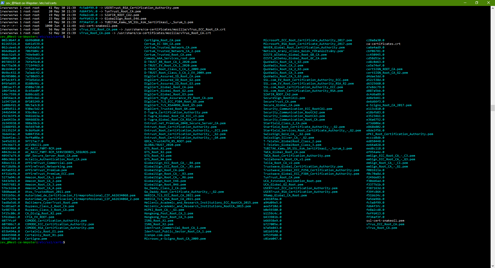

**SEC-06 - Public Key Infrastructure**
===
**Key-terms**
---

**Symetric encrytion:** Is a one way encrytion. All messages being send, back and forth, are open by the same key. There is a security risk involed using this method since it is very hard to communicate the key without it being comprimized. 

**Asymetric ecryption:** In this way of encrypting you make use of a public and private key. This way, messages that are encrypted with your public key, can only be opened with your private key. 

**Public key:** Public keys are encrypted keys that can only be opened with the assigned private key. This key is visible for everyone and is used to send messages only you can open, if you kept your private key private. 

**Private key:** Private keys are created with public keys and are the actual key to open the messages encrypted by someone else with your public key. If I were to send a message back, I would encrypt my message with the recievers public key. 

**PKI:** Public Key Infrastructure is a set of roles, policies, hardware, software and procedures needed to create, manage distribute, use, store and revoke digital certificates and manage public-key encryption.
It consist of 3 entities that assure you can communicate securely over an insecure network.

The three entities are:

- Certificate Authority (CA): A Certificate Authority is a trusted third-party organization responsible for issuing and managing digital certificates. The CA verifies the identity of individuals, organizations, or devices requesting certificates and digitally signs the certificates, binding the public key to the identity. The CA's role is crucial in establishing trust and ensuring the integrity of the PKI.

- Registration Authority (RA): A Registration Authority assists the CA by performing administrative tasks related to certificate enrollment and validation. The RA acts as an intermediary between the CA and the certificate applicant, verifying the identity and other details before forwarding the request to the CA for certificate issuance. The RA helps streamline the certificate enrollment process and ensure the accuracy of the information provided.

- Certificate Repository: The Certificate Repository serves as a centralized database or repository that stores and distributes issued digital certificates. It provides a means for users and relying parties to access and retrieve public key certificates for verification purposes. The repository allows for easy retrieval of certificates and facilitates the validation of digital signatures during secure communication.

**X.509:** X.509 is a standard for digital certificates used in Public Key Infrastructure (PKI) systems. It defines the format and content of certificates used to verify and authenticate the identity of entities in secure communication. X.509 certificates contain information such as the entity's public key, identity, and a digital signature from the Certificate Authority (CA) that issued the certificate. These certificates are widely used in various applications like web browsing, email encryption, and VPNs to establish secure and trusted communication. X.509 ensures standardized and secure identification within a PKI.

**Opdracht**
---

- Create a self-signed certificate on your VM.

- Analyze some certification paths of known websites (ex. techgrounds.nl / google.com / ing.nl).

[Algemeen Techgrounds](../00_includes/SEC-06/algemeentechgrounds.png)   
    [Details Techgrounds](../00_includes/SEC-06/detailstechgrounds.png)

[Algemeen ING](../00_includes/SEC-06/INGalgemeen.png)    
    [Details ING](../00_includes/SEC-06/INGdetails.png)

- Find the list of trusted certificate roots on your system (bonus points if you also find it in your VM).

*Gebruikte bronnen*
---

[IBM Technology Tech Talk](https://www.youtube.com/watch?v=0ctat6RBrFo)

[linuxconfig](https://linuxconfig.org/how-to-generate-a-self-signed-ssl-certificate-on-linux)

[Digital ocean](https://www.digitalocean.com/community/tutorials/how-to-create-a-self-signed-ssl-certificate-for-apache-in-ubuntu-16-04)

[Google support](https://support.google.com/chrome/answer/95617?visit_id=638229433365720663-2816721762&p=root_store&rd=1#root_store&zippy=%2Capparaatcertificaten-beheren-op-mac-en-windows)

[Serverfault](https://serverfault.com/questions/62496/ssl-certificate-location-on-unix-linux)

[Microfocus](https://www.microfocus.com/documentation/net-express/nx51ws01/cjtcer.htm#:~:text=Click%20Tools%20>%20Internet%20Options%20>%20Content,software%20in%20your%20Web%20browser.)

*Ervaren problemen*
---

Een peer en ik kwamen er achter dat we het zelfde resultaat hadden bereikt met iets wat anders opgeschreven code. Beide bleek juist.

*Resultaat!*
---

