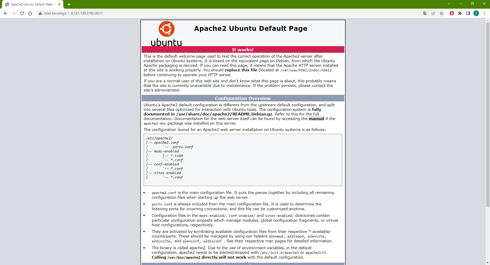
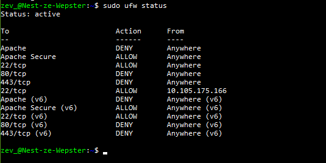
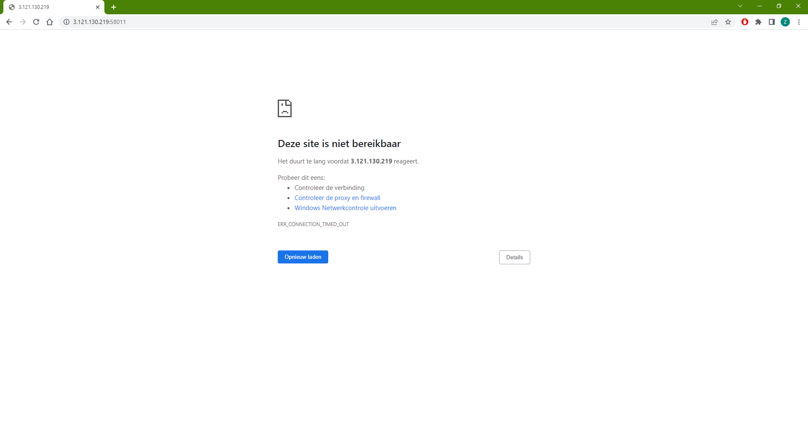

**SEC-02 - Firewalls**
===
**Key-terms**
---

**Stateful:** A stateful firewall is a firewall that maintains a "state" of stores information about active network connections. When a connection is opened, the firewall begins tracking it and updates its internal state as new packets are inspected and processed by the firewall.

**Stateless:** A stateless firewall differs from a stateful one in that it doesn’t maintain an internal state from one packet to another. Instead, each packet is evaluated based on the data that it contains in its header.

Stateful and stateless firewalls largely differ in that one type tracks the state between packets while the other does not. Otherwise, both types of firewalls operate in the same way, inspecting packet headers and using the information they contain to determine whether or not traffic is valid based on predefined rules. The state maintained by stateful firewalls enables it to identify various threats that stateless firewalls cannot.

**Host based firewall:** A host based firewall is software that gets installed on a computer, protecting only that computer.

**Network based firewall:** A network based firewall is usually a combination of Hard- and Software which protects the whole network.

**Opdracht**
---

- Installeer een webserver op je VM.

    Apache2 is een webserver die we voor een eerder opdracht al hadden geinstaleerd.

- Bekijk de standaardpagina die met de webserver geïnstalleerd is.

- Stel de firewall zo in dat je webverkeer blokkeert, maar wel - ssh-verkeer toelaat.

de poorten 80 en 443 zijn HTTP(S) poorten en voorkomen, in dit geval omdat ze op deny staan, al het internet verkeer. Poort 22 is de SSH poort.

- Controleer of de firewall zijn werk doet.

*Gebruikte bronnen*
---

[Digital ocean](https://www.digitalocean.com/community/tutorials/how-to-install-the-apache-web-server-on-ubuntu-20-04)

[Beginninglinux.com](http://www.beginninglinux.com/home/server-administration/firewall/enable-firewall-on-server-without-ssh-disconnect)

[Checkpoint](https://www.checkpoint.com/cyber-hub/network-security/what-is-firewall/what-is-a-stateful-firewall/stateful_vs_stateless_firewall/#:~:text=A%20stateless%20firewall%20differs%20from,of%20inbound%20and%20outbound%20connections.)

*Ervaren problemen*
---

Welk adres in te voeren in de webbrowser duurde even om uit te vogelen, samen met mijn peers er uiteindelijk uitgekomen.

*Resultaat!*
---

