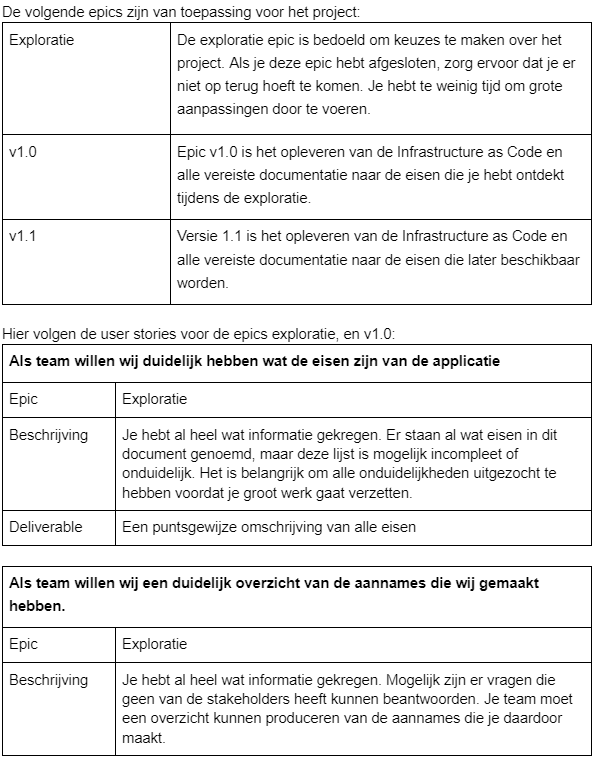

# Assignment Project V1.0

## Introduction
In de afgelopen maanden heb je veel geleerd over de cloud en deze kennis toegepast op relatief kleine opdrachten. Dit gaat nu allemaal samenkomen in de volgende grote opdracht waarin je een bestaande architectuur verbetert en automatiseert. Hier onder zie je de bestaande Architectuur:

Je zal de komende weken samen aan individuele oplossingen werken voor je eigen cloud provider waarbij je te maken krijgt met bedrijfsbeleid, eisen van eindgebruikers, eisen van collega’s, en de tijdsdruk van een groot project in een beperkte tijd. Hierin zullen de verwachtingen op het niveau van een junior engineer zijn.

- Wat zijn de verwachtingen in dit project?
- Met weinig begeleiding nieuwe kennis opdoen en toepassen
- Op een abstract niveau het project begrijpen
- Zelfstandig problemen op kunnen lossen
- Een discussie kunnen aangaan over de technische elementen
- Verbeteringen kunnen suggereren op code- en projectniveau

Jij bent verantwoordelijk voor het verhuizen van de huidige servers naar de cloud en voor het automatiseren van de deployment van deze infrastructuur. Dit moet gedaan worden in CDK (voor AWS) of Bicep (voor Azure). Voorlopig is het genoeg om simpele placeholder content te gebruiken voor de website (denk aan een simpele index.html in plaats van een hele website).

We zullen werken met sprints van 2 weken waar je aan het eind van de sprint je progressie presenteert aan de stakeholders. Je zal uiteindelijk het project met de deliverables individueel inleveren via GitHub. 

## **Benodigdheden**
- Je GitHub repository
- Project Templates
- Je cloudomgeving

## **Opdracht**

Je hebt een opdracht gekregen om een bedrijf te helpen bij de transitie naar de cloud. Het bedrijf heeft zijn infrastructuur laten analyseren door een eerder team. Er is een diagram gemaakt naar aanleiding van de huidige situatie.

Jij zal de Infrastructure as Code app bouwen om dit ontwerp naar de cloud te brengen. Het is de bedoeling dat je voor deze app CDK van AWS of Bicep van Azure gebruikt. De volgende eisen zijn aangegeven als noodzakelijk:

    - Alle VM disks moeten encrypted zijn.
    - De webserver moet dagelijks gebackupt worden. De backups moeten 7 dagen behouden worden.
    - De webserver moet op een geautomatiseerde manier geïnstalleerd worden.
    - De admin/management server moet bereikbaar zijn met een publiek IP.
    - De admin/management server moet alleen bereikbaar zijn van vertrouwde locaties (office/admin’s thuis)
    - De volgende IP ranges worden gebruikt: 10.10.10.0/24 & 10.20.20.0/24
    - Alle subnets moeten beschermd worden door een firewall op subnet niveau.
    - SSH of RDP verbindingen met de webserver mogen alleen tot stand komen vanuit de admin server.
    - Wees niet bang om verbeteringen in de architectuur voor te stellen of te implementeren, maar maak wel harde keuzes, zodat je de deadline kan halen.

In de uitwerking van de CDK/Bicep-app zorg ervoor dat je klein begint en dat je incrementeel features toevoegt. Zorg ervoor dat je altijd een commit / branch heb waar je op terug kan vallen met een werkende versie van je applicatie. Je kan met Git Tag commits labels geven die makkelijk in GitHub terug te vinden zijn. Mocht je code compleet zijn met de bovengenoemde eisen, dan kan je de tag ‘v1.0’ gebruiken.

De meeste deelnemers gebruiken ongeveer €30-40 voor het gehele project. Er is een absoluut maximum van €50 per deelnemer. Ga je daar overheen, dan wordt het project direct stopgezet.

### Definition of Done
Wanneer is een user story af?
- Als de user story een deliverable heeft: wanneer deze op Github staat.
- Als de user story over een stuk IaC gaat: wanneer deze geïsoleerd gedeployed kan worden zonder foutmeldingen.
- Wanneer de documentatie over de user story op Github bijgewerkt is.

Wanneer is een versie van de app af?
- v1.0: Als deze voldoet aan alle eisen zoals aangegeven in dit document
- v1.1: Als deze voldoet aan alle nieuwe eisen.

### Deliverables:
De volgende deliverables worden verwacht in je GitHub repository aan het eind van dit project:
- Een werkende CDK / Bicep app van het MVP

        De werkende applicatie moet een build en een deployment succesvol afronden. Een versie van je MVP moet eenvoudig te identificeren zijn. Dit kan met een tag, of een release. Daarnaast moet je repository documentatie bevatten over hoe je de applicatie gebruikt. Hierin geef je aan hoe je de applicatie aanroept, de argumenten die nodig zijn, en welke rechten deze nodig heeft in AWS of Azure om te deployen.

- Ontwerp Documentatie

      Je zal de bestaande architectuur gebruiken. Er zijn nog wel details die verder uitgewerkt dienen te worden. In dit document zal je de gaten opvullen en uiteindelijk de praktische en technische informatie vermelden in GitHub. Dit document zal informatie bevatten over je gekozen (N)SG regels. Maar ook een visualisatie van wat, en in welke volgorde, je applicatie deployt in de cloud.
        In v1.1 zal je hier ook je eigen diagrammen plaatsen voor de aanpassingen en de verbeteringen onderbouwen.
  
- Beslissing Documentatie

        Tijdens het implementeren van het ontwerp zal je beslissingen maken over o.a. diensten die je gaat gebruiken. In dit document zal je je overwegingen uitschrijven en je besluiten onderbouwen. Dit document zal ook al je assumpties en verbeteringen bevatten. Dit dient als basis voor je ontwerp documentatie.

- Tijd logs

        Dit is bestand waar je in gestructureerd je dagen bijhoudt. Je geeft aan in 1 enkele zin waar je aan gewerkt hebt die dag. Puntsgewijs zal je de obstakels aangeven die je hebt ervaren en de oplossingen die je hebt gevonden.

- Tussentijdse Presentaties

         Je zal aan het eind van iedere sprint een presentatie maken van je voortgang. Hierin behandel je wat je de afgelopen sprint heb gedaan. En bij de oplevering laat je een demo zien van je werk.

- Eindpresentatie

        Op de laatste vrijdag van het project presenteert men het gehele project aan elkaar. Hierin deel je je ervaring, je design decisions, en de architectuur van je project.

### User Stories

De Product Owners hebben al een overleg gehad en hebben de volgende epics en backlog opgesteld. Jij gaat als team aan deze epics en user stories werken.
Mocht je met je team user stories identificeren die opgesplitst moeten worden in kleinere stories, is je team hier vrij in.

### Belangrijke data:

Belangrijkste data in het project:
| Onderwerp | Datum (projectweek) |
|--- |---|
| Introductie Project V1.1 | 11-09-2023 (wk 5)
| Oplervering-/ Eindpresentatie | 03-10-20233 (wk8)

Data tussentijdse projectactiviteiten:
| **Project activiteit** | **Datum (projectweek):**
|---|---|
|Sprint 1 Review progressie app v1.0 | 01-09-2023 (wk3)*|
|Sprint 2 Review **oplevering** app v1.0 | 15-09-2023 (wk5)|
|Sprint 3 Review progressie app v1.1| 22-09-2023 (wk6)**|
|Sprint 3 Review progressie app v1.1| 29-09-2023 (wk7)|
|Sprint 4 Review oplevering app v1.1 / Eindpresentatie | 06-10-2023 (wk 8)|

*Afwezig i.v.m. UTMB.

** Data van toepassing op andere helft van de groep.
