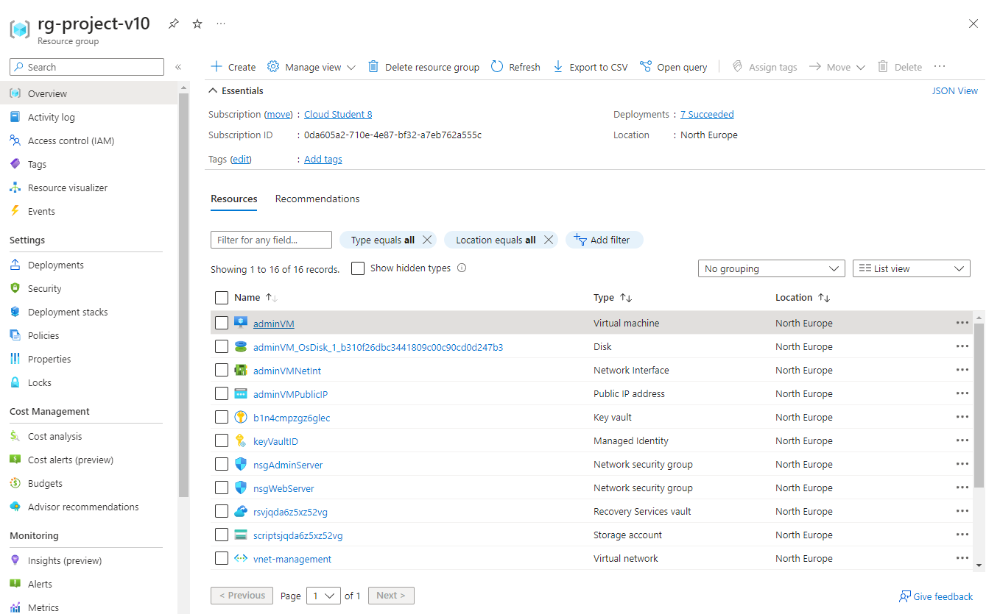
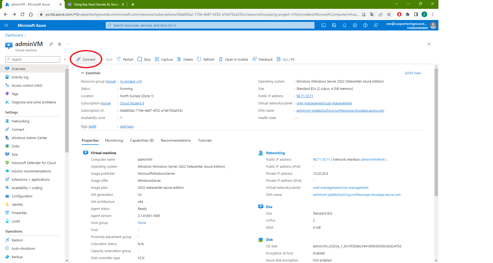
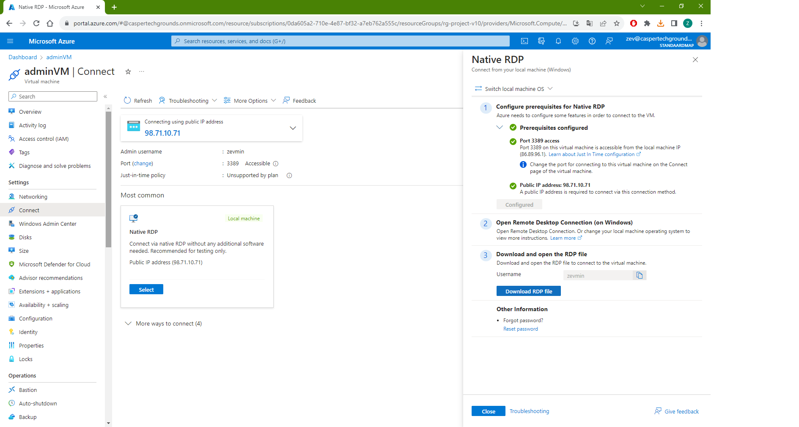

## User Manual

This document will instruct you on how the application can be deployed in your Azure environment. It will outline the prerequisites, commands and parameters needed to create a successful deployment.

The following steps use the Azure Command Line Interface to deploy resources using a bicep file. If you prefer another method please visit the following Microsoft documentation pages:

- Deploy using **Visual Studio Code**
https://learn.microsoft.com/en-us/azure/azure-resource-manager/bicep/deploy-vscode
- Deploy using **PowerShell**
https://learn.microsoft.com/en-us/azure/azure-resource-manager/bicep/deploy-powershell
- Deploy using **CloudShell**
https://learn.microsoft.com/en-us/azure/azure-resource-manager/bicep/deploy-cloud-shell?tabs=azure-cli

Otherwise follow the steps below to use our preferred method (Azure CLI):

### Prerequisites

#### Step 1
Install Azure CLI commands on your local computer. To deploy Bicep files, you need Azure CLI version 2.20.0 or later.
https://learn.microsoft.com/en-us/cli/azure/install-azure-cli

#### Step 2
Connect to Azure by using ``az login``. If you have multiple Azure subscriptions, you might also need to run ``az account set``. To check which subscription you are now use ``az account show``.

#### Step 3
Change your current working directory to the folder containing the main.bicep file using the ```cd <path>``` command. Replace ```<path>``` with the path to the application folder. 

### Deployment

To deploy the application use the code below:

        az deployment sub create --location 'northeurope' --template-file ./main.bicep

During deployment you will get asked to provide a login and password. These are for your (admin)access to the VMs.

**Important**: the Login Name and Password have several security requirements.

**Login Name**:
- Usernames can be a maximum of 20 characters in length and cannot end in a period (".").


**Login Password**:
The password must have:

- Have between 12 - 123 characters
- Have lower characters
- Have upper characters
- Have a digit
- Have a special character

After this everything will start deploying and this will take a couple of minutes.

### Connecting

For connecting to your adminVM the easiest way is trough the portal:

1. Go to the [Azure portal](https://portal.azure.com) and login to the respective account where everything is deployed.

2. Find the adminVM


3. Click on it and press connect


4. Make sure you connect to the public IP-address with Native RDP and download the RDP file and open it.


5. A warning screen will pop up, press connect and put in the **username** and **password** put in earlier. Another warning screen will pop up where you can press connect and the VM will boot in a Remote envoirment. 

You are now in the adminVM, for connecting to the webserverVM follow these steps:

6. Right click the startbutton to open Powershell (normal or admin will work both)

7. Type the command ```ssh <adminUsername>@10.10.10.04``` and you first will get a question about fingerprints, type yes to add yourself to a trusted file. 

8. Next it will ask for a **password**, this is the one you set up at the beginning. and now you are connected to your webserverVM trough your adminVM.